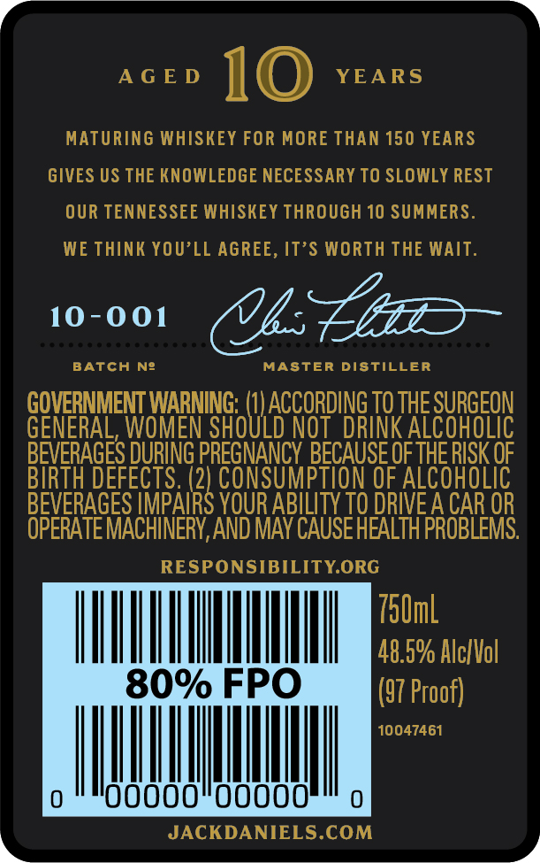
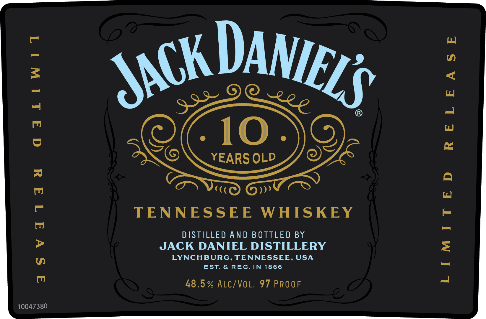

# TTB COLA Label Images - TTBID 21091001000930

**Brand Name:** JACK DANIEL'S

**Fanciful Name:** 10 YEARS OLD

**Issue Date:** 04/05/2021

**Origin Code:** 43

**Product Class/Type:** 109

**Source:** [TTB Public COLA Registry](https://ttbonline.gov/colasonline/viewColaDetails.do?action=publicFormDisplay&ttbid=21091001000930)

## Label Images

### Back Label

### Front Label

### Label 3

## Extracted Label Text

*Text extracted via OCR - may contain errors*

*1 image(s) excluded: text did not meet readability threshold*

**Detected Proof:** 97
**Detected Age:** 10 Years

### Back Label

AGED 10 YEARS

MATURING WHISKEY FOR MORE THAN 150 YEARS

GIVES US THE KNOWLEDGE NECESSARY TO SLOWLY REST

OUR TENNESSEE WHISKEY THROUGH 10 SUMMERS

WE THINK YOU’LL AGREE, IT’S WORTH THE WAIT

10-001 OU Lp

BATCH Nf

MASTER DISTILLER

Senet Heiipit sates wna i THE SURG

EON

LIC

BEVERAGES DURING PEs) BECAUSE OF THERISK OF

IRTH D.

ALCOHOLIC

BEVERAGES IMP

YOUR ABILITY TO DRIVE A CAR OR

OPERATE MACHINERY, AND MAY CAUSE HEALTH PROBLEMS

RESPONSIBILITY.ORG

T0mL

Hn

|

!

|

|

l

48.5% Alc/Vol

FPO

(57 Proof)

10047461

wwii

00000

JACKDANIELS.COM

### Front Label

qaLiwtidt

aSVatTad

10047380

TENNESSEE WHISKEY

DISTILLED AND BOTTLED BY
JACK DANIEL DISTILLERY
LYNCHBURG, TENNESSEE, USA
EST. & REG. IN 1866

48.5% ALC/VOL. 97 PROOF

RELEASE

LIMITED
