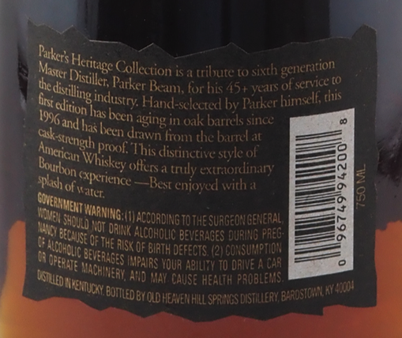
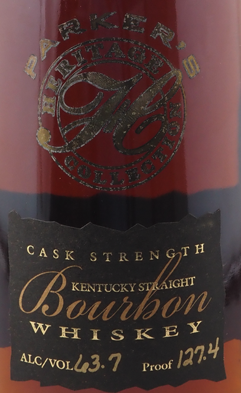
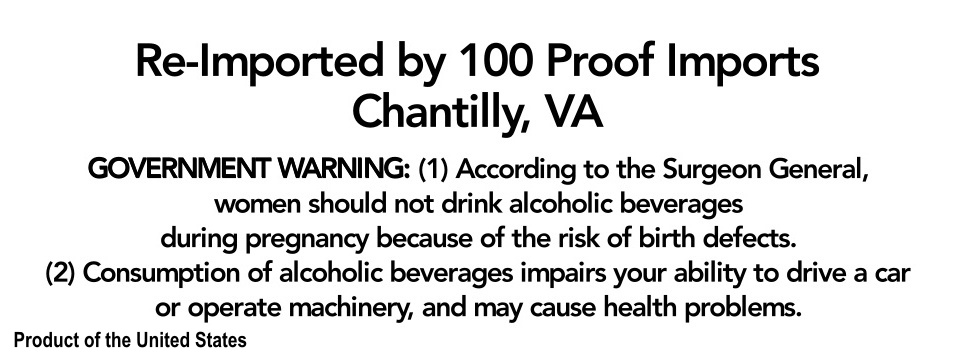

# TTB COLA Label Images - TTBID 21098001000481

**Brand Name:** PARKER'S HERITAGE

**Fanciful Name:** CASK STRENGTH

**Issue Date:** 04/16/2021

**Origin Code:** 22

**Product Class/Type:** 192

**Source:** [TTB Public COLA Registry](https://ttbonline.gov/colasonline/viewColaDetails.do?action=publicFormDisplay&ttbid=21098001000481)

## Label Images

### Back Label

### Front Label

### Label 3

## Extracted Label Text

*Text extracted via OCR - may contain errors*

### Back Label

, ren h generation

j EE Colon a stint sich ae
Se Diss phon for his 45» years of er
. falling indstry Hand-sclected by Parker 5

\ IyeatO hasbeen ine in ok barrelssince —— ‘
seth atl ha been drawn Yros the barrel 2ze

P Angin proof. ‘This distinctive syle ol Ce
ec, Tasty fsa tly exon ae =" E
Blah PENCE Bese eno d with ' z= fg
TaN UG c2soxer A TD as ee
wg SD eT vai ara TE Ot
hg et FISK OF inTH eFECTS, (2) cONSUMP >,

AAMAS Pans youR au To AVE ACR 5

rere aS UR ener
SPM vane S ;

### Front Label

c

ASk srrENG?H
. //

KENTUCKY syfAicat d

Mt atl

dawiso
HIsKEY

| Alcor d3-7 proof ja

### Label 3

Re-Imported by 100 Proof Imports

Chantilly, VA

GOVERNMENT WARNING: (1) According to the Surgeon General,

women should not drink alcoholic beverages

during pregnancy because of the risk of birth defects.

(2) Consumption of alcoholic beverages impairs your ability to drive a car

or operate machinery, and may cause health problems.

Product of the United States
