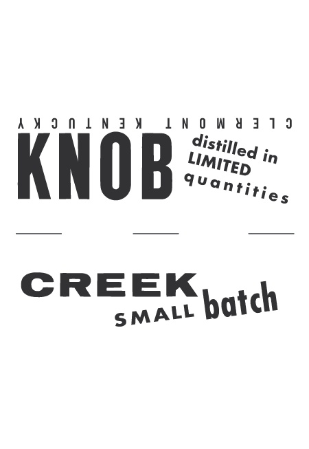
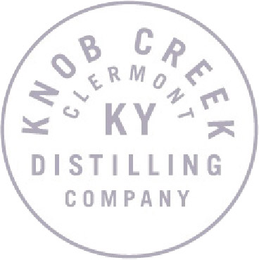

# TTB COLA Label Images - TTBID 21111001000727

**Brand Name:** KNOB CREEK

**Issue Date:** 04/30/2021

**Origin Code:** 22

**Product Class/Type:** 101

**Source:** [TTB Public COLA Registry](https://ttbonline.gov/colasonline/viewColaDetails.do?action=publicFormDisplay&ttbid=21111001000727)

## Label Images

### Label 1

### Label 2

### Label 3

### Label 4

### Label 5

## Extracted Label Text

*Text extracted via OCR - may contain errors*

*3 image(s) excluded: text did not meet readability threshold*

### Label 1

LIMITE D
E D [T|0 N
I
heavynGaromes andotossted
Y
oak
With
hints
of
sweet
8
5
4
Iknob
Jenthez,
Theonetatnd_Sight
1
E
5
baxotairethuithhvahalled
7
1
and
caramel
The
finish
is
Warm
With
a
touch of
3
1
[
8
CREEK
brown spice_
8
2
21
1
AGED
KEN TOURBGTRAIGSKEY
F
15
FEArsN
RELEASE NO/
KC002
DSP/
KY-230
1

### Label 3

GOVERNMENT WARNING: (I) ACCORDING TO THE SURGEON GENERAL,
IOMEN  ShOULD NOT DRINK ALCOhOLIC BEVERAGES DURING PREG
NANCV BECAUSE OF ThE RUSK OF BIRTH DEFECTS. (2) CONSUMPTLON
OF ALCOHOLIC BEVERAGES IMPAIRS YOUR AbTy TO DRIVE A CaR
OR  OPERATE   MACHINERK AND  MAy  CAUSe  HEeALTH  PROBLEMS.
Per 1.5 f. oz - Average Analysis: Calories 122.0, Carbohydrates 0.Og; Protein Og; Fat Og
750 mL | 509 ALc_NVOL:
MEVT REF 154 . IA REF 54
DSTHLLED AND BOTTLED BY
1
KNOB CREEK DISTILLING COMPANK
CLERMONT; KENTUcKN
WWW_KNOBCREEK.COM
'80686"03504
6
8
WWW_DRINKSMART.COM
