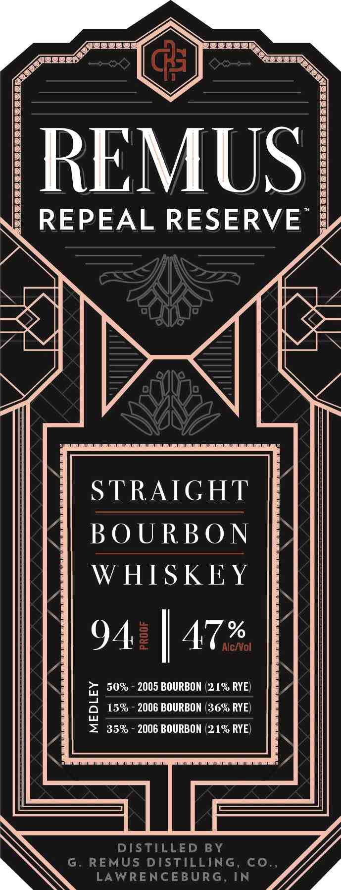
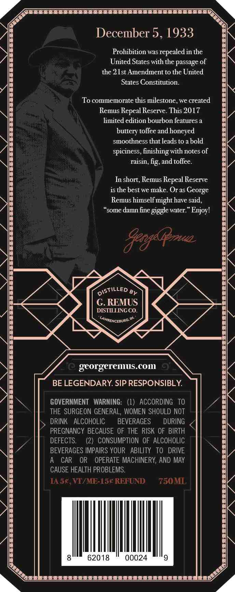
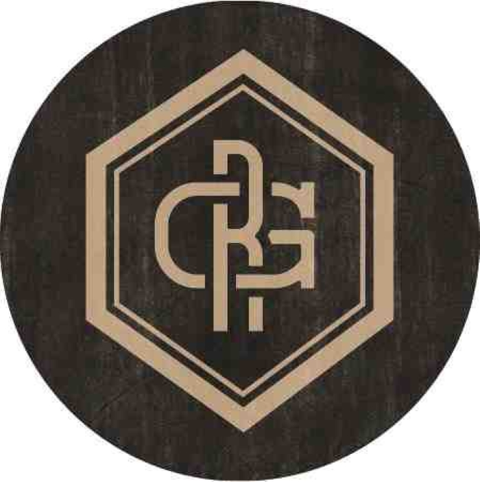

# TTB COLA Label Images - TTBID 21111001000763

**Brand Name:** REMUS REPEAL RESERVE

**Issue Date:** 04/22/2021

**Origin Code:** 29

**Product Class/Type:** 101

**Source:** [TTB Public COLA Registry](https://ttbonline.gov/colasonline/viewColaDetails.do?action=publicFormDisplay&ttbid=21111001000763)

## Label Images

### Label 1

### Label 2

### Label 3

### Label 4

## Extracted Label Text

*Text extracted via OCR - may contain errors*

### Label 1

ee

— oN

REMUS

REPEAL RESERVE

NIN

WWI

Q |

l <

7 |

INMZTN

DaN

STRAIGHT

BOURBON

WHISKEY

AW,

94: |

2 50% - 2005 BOURBON (21% RYE)

= 35% - 2006 BOURBON (21% RYE)

a 15% - 2006 BOURBON (36% RYE)

DISTILLED BY

WN

G. REMUS DISTILLING, CO.,

LAWRENCEBURG, IN

WV

### Label 2

0 a N

December 5, 1933

Prohibition was repealed in the

United States with the passage of

the 21st Amendment to the United

States Constitution.

To commemorate this milestone, we created

Remus Repeal Reserve. This 2017

\\

limited edition bourbon features a

buttery toffee and honeyed

smoothness that leads to a bold

spiciness, finishing with notes of

\\e

raisin, fig, and toffee.

In short, Remus Repeal Reserve

is the best we make. Or as George

Remus himself might have said,

“some damn fine giggle water.” Enjoy!

be

APY

NI

Ai

NSTILLED g

G. REMUS

DISTILLING CO.

Ne

BN

Simencesune™

x

georgeremus.com

BE LEGENDARY. SIP RESPONSIBLY.

GOVERNMENT WARNING: (1) ACCORDING TO

THE SURGEON GENERAL, WOMEN SHOULD NOT

BEVERAGES

DURING

s, DRINK ALCOHOLIC

PREGNANCY BECAUSE OF THE RISK OF BIRTH

BIN

DEFECTS.

(2) CONSUMPTION OF ALCOHOLIC

BEVERAGES IMPAIRS YOUR ABILITY TO DRIVE

A CAR OR OPERATE MACHINERY, AND MAY

CAUSE HEALTH PROBLEMS.

TAd5¢,V

if

(S€ REFUND

50MI

/ |i

Mi

L

62018

00024

|

S

2 NY tas

### Label 3

KY

REPEAL

SERIES

### Label 4

om

=

1 |

_

Ww)

1]

BS

P|

~~

Li

~,

é

te
