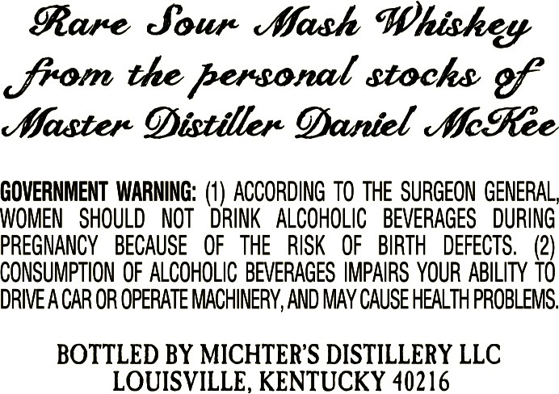
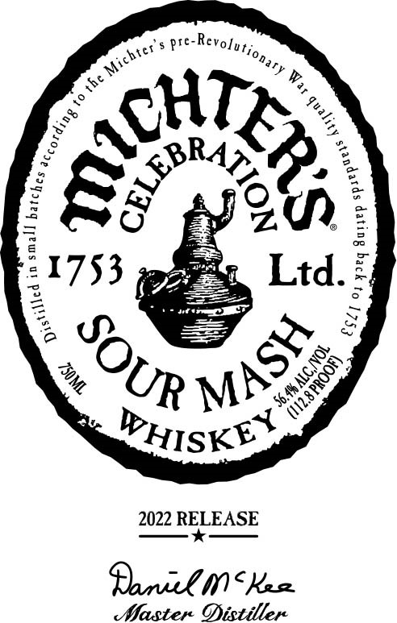

# TTB COLA Label Images - TTBID 21196001000491

**Brand Name:** MICHTER'S

**Fanciful Name:** CELEBRATION 2022 RELEASE

**Issue Date:** 07/19/2021

**Origin Code:** 22

**Product Class/Type:** 140

**Source:** [TTB Public COLA Registry](https://ttbonline.gov/colasonline/viewColaDetails.do?action=publicFormDisplay&ttbid=21196001000491)

## Label Images

### Back Label

### Front Label

## Extracted Label Text

*Text extracted via OCR - may contain errors*

### Back Label

Rare Sour Mash Whiskey

jrom the personal stocks:

Master Distiller Daniel MeRee

GOVERNMENT WARNING: (1) ACCORDING TO THE SURGEON GENERAL

WOMEN SHOULD NOT DRINK ALCOHOLIC BEVERAGES DURING

PREGNANCY BECAUSE OF THE RISK OF BIRTH DEFECTS. (2)

CONSUMPTION OF ALCOHOLIC BEVERAGES IMPAIRS YOUR ABILITY TO

DRIVE A CAR OR OPERATE MACHINERY, AND MAY CAUSE HEALTH PROBLEMS.

BOTTLED BY MICHTER'’S DISTILLERY LLC

LOUISVILLE, KENTUCKY 40216

### Front Label

pre-Revosy,

a

MT,

PRY

va A

Ei

1753

Ltd. =

2 SD

Pe)

“e

SS

Op wir

NS

RY

Prisk tt

2022 RECEASE

Panik I< Kase

Master Distiller
