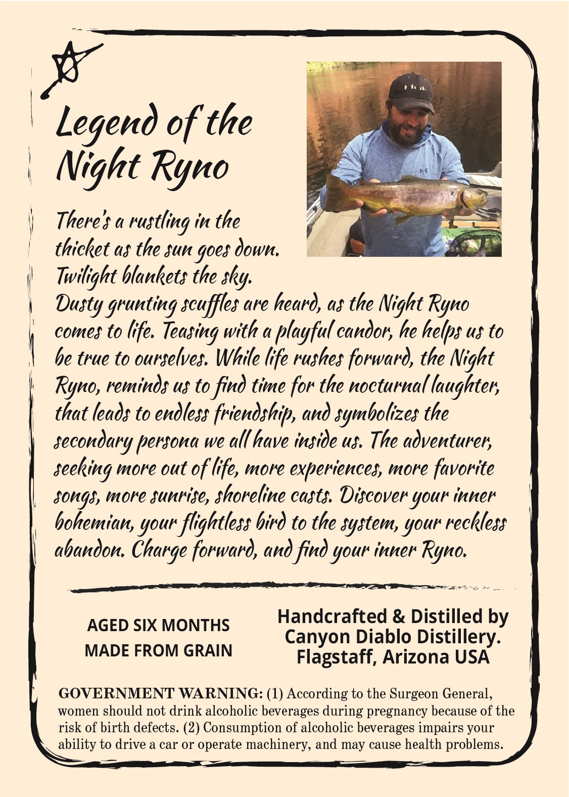
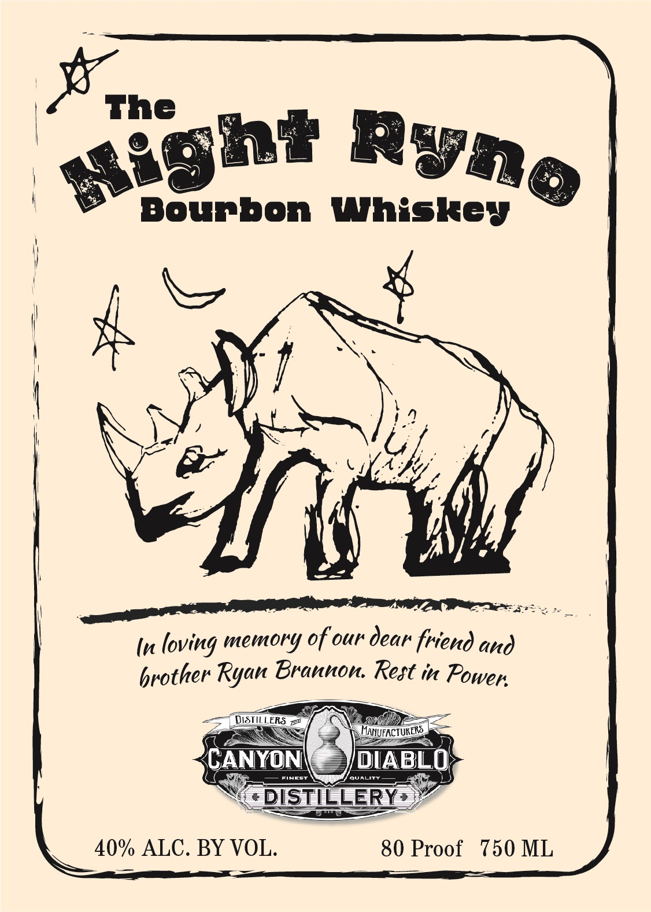

# TTB COLA Label Images - TTBID 21210001000878

**Brand Name:** CANYON DIABLO DISTILLERY

**Fanciful Name:** NIGHT RYNO BOURBON WHISKEY

**Issue Date:** 08/02/2021

**Origin Code:** 11

**Product Class/Type:** 141

**Source:** [TTB Public COLA Registry](https://ttbonline.gov/colasonline/viewColaDetails.do?action=publicFormDisplay&ttbid=21210001000878)

## Label Images

### Back Label

### Front Label

## Extracted Label Text

*Text extracted via OCR - may contain errors*

**Detected Proof:** 80

### Back Label

Legend of the
Night Ryno
There$ &
in the
thicket as the sun goes down.
Twilight blankets the sky;
grunting scuffles are heard, as the Night Ryno
comes to life.
Teasing with a playful candor; he hetps us to
be true to ourselves. While lfe rushes forward, the Night
Ryno, reminds u} to
time for the nocturnal laughter;
that leads to endless friendship , and symbolizes the
secondary _
we all have inside us. The adventurer;
seeking more out of lfe, more experiences, more favorite
songs, more sunrise, shoreline casts Discover your inner
hohemian, your flightless bird to the system, your reckless
abandon
forward, and find your inner Ryno.
AGED SIX MONTHS
Handcrafted & Distilled by
Canyon Diablo Distillery:
MADE FROM GRAIN
Flagstaff; Arizona USA
GOVERNMENT WARNING: (1) According to the Surgeon General,
women should not drink alcoholic beverages during pregnancy because of the
risk of birth defects. (2) Consumption of alcoholic beverages impairs your
ability to drive a car or operate machinery, and may cause health problems.
rustling
Dusty_
find
persona
Charge

### Front Label

The
Bourbon
Whiskey
(
In loving memory ofour dear friend and
brother Ryan Brannon Rest in Power
DISTILLERS
Zn
HANUFACTURERS
CANYON
DIABLO
SINCST
cualIty
DISTIELERRY >
40% ALC. BY VOL:
80 Proof
750 ML
ae3h*
RVze
