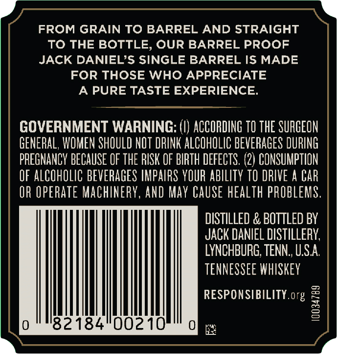
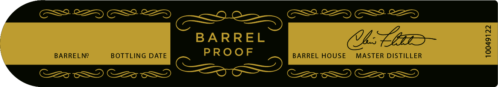
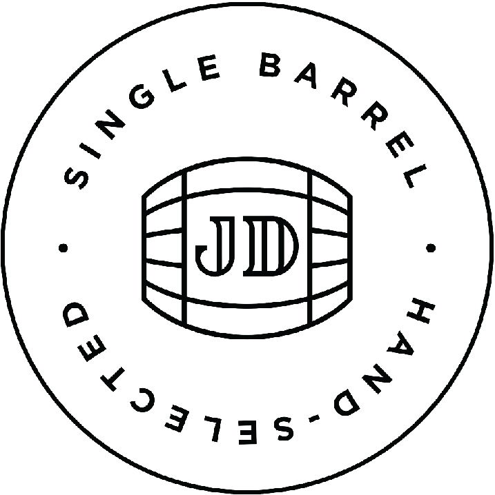

# TTB COLA Label Images - TTBID 21222001000653

**Brand Name:** JACK DANIEL'S

**Fanciful Name:** SINGLE BARREL BARREL PROOF

**Issue Date:** 08/11/2021

**Origin Code:** 43

**Product Class/Type:** 140

**Source:** [TTB Public COLA Registry](https://ttbonline.gov/colasonline/viewColaDetails.do?action=publicFormDisplay&ttbid=21222001000653)

## Label Images

### Back Label

### Front Label

### Label 4

### Label 5

## Extracted Label Text

*Text extracted via OCR - may contain errors*

*3 image(s) excluded: text did not meet readability threshold*

### Back Label

FROM GRAIN TO BARREL AND STRAIGHT

TO THE BOTTLE, OUR BARREL PROOF

JACK DANIEL’S SINGLE BARREL IS MADE

FOR THOSE WHO APPRECIATE

A PURE TASTE EXPERIENCE.

GOVERNMENT WARNING: (I) ACCORDING 10 THE SURGEON

GENERAL, WOMEN SHOULD NOT DRINK ALCOHOLIC BEVERAGES DURING

PREGNANCY BECAUSE OF THE RISK OF BIRTH DEFECTS. (2) CONSUMPTION

OF ALCOHOLIC BEVERAGES IMPAIRS YOUR ABILITY TO DRIVE A CAR

OR OPERATE MACHINERY, AND MAY CAUSE HEALTH PROBLEMS

DISTILLED & BOTTLED BY

JACK DANIEL DISTILLERY,

LYNCHBURG, TENN., U.S.A.

TENNESSEE WHISKEY

RESPONSIBILITY. org

|

82184°00210'
