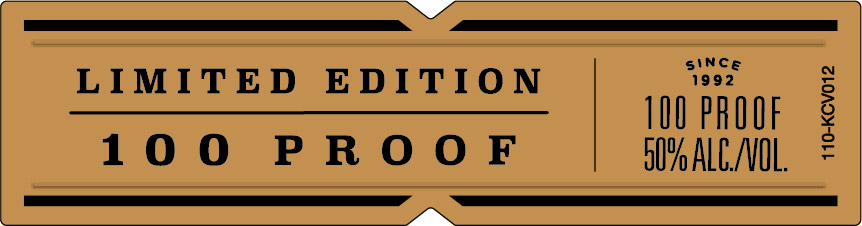
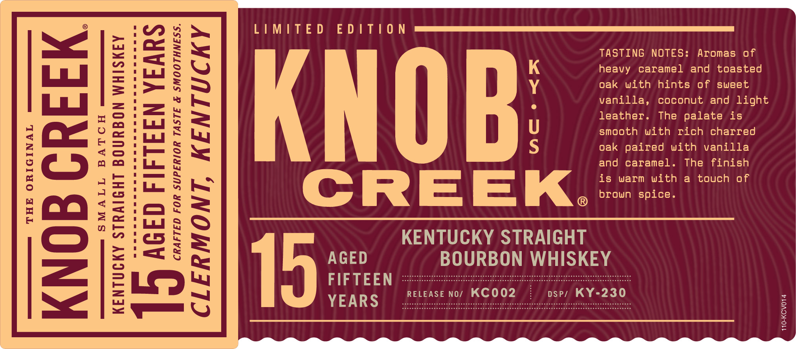
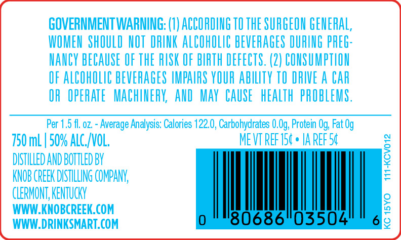
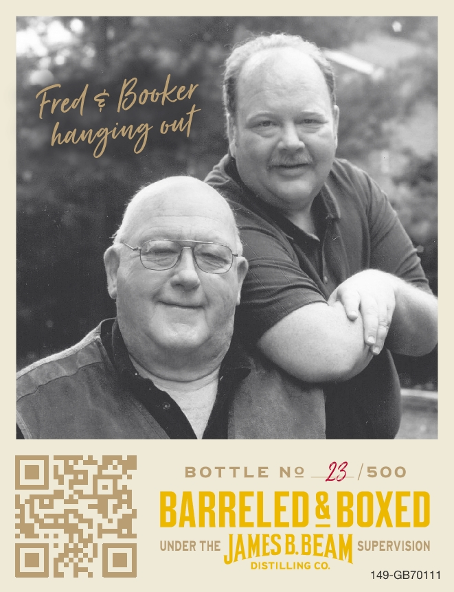
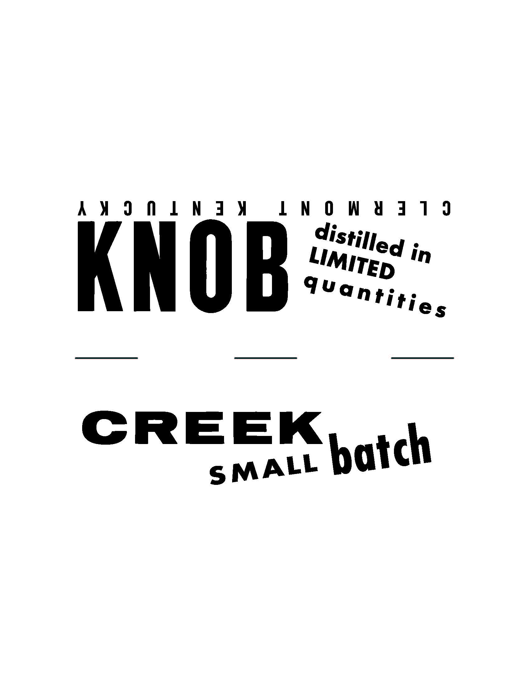

# TTB COLA Label Images - TTBID 21256001000040

**Brand Name:** KNOB CREEK

**Issue Date:** 09/15/2021

**Origin Code:** 22

**Product Class/Type:** 101

**Source:** [TTB Public COLA Registry](https://ttbonline.gov/colasonline/viewColaDetails.do?action=publicFormDisplay&ttbid=21256001000040)

## Label Images

### Label 1

### Label 2

### Label 3

### Label 4

### Label 5

### Label 6

## Extracted Label Text

*Text extracted via OCR - may contain errors*

*1 image(s) excluded: text did not meet readability threshold*

**Detected Proof:** 100

### Label 1

LIMITED EDITION

100 PROOF

100 PROOF
FIM ALD

410-KCVO12 —

### Label 2

LI MUTED EDU TU O Ni  cimmmmmmmm

TASTING NOTES: Aromas of
heavy caramel and toasted
oak with hints of sweet
vanilla, coconut and light
leather. The palate is
smooth with rich charred
oak paired with vanilla
and caramel. The finish

brown spice.
(@) p

KENTUCKY STRAIGHT
15 AGED BOURBON WHISKEY

SMALL BATCA exc
NE e <A

KENTUCKY STRAIGHT BOURBON WHISKEY

19

AGED FIFTEEN YEARS

FIFTEEN * \,
YEARS _RELEASE NO/ KC002 DSP/ KY-230°

a
<q
4
_
2]
=
i
°
|
io]
B

KNOB CREEK.

CLERMONT, KENTUCKY

110-KCV014

### Label 3

GOVERNMENT WARNING: (I) ACCORDING TO THE SURGEON GENERAL,
IOMEN  ShOULD NOT DRINK ALCOhOLIC BEVERAGES DURING PREG
NANCV BECAUSE OF ThE RUSK OF BIRTH DEFECTS. (2) CONSUMPTLON
OF ALCOHOLIC BEVERAGES IMPAIRS YOUR AbTy TO DRIVE A CaR
OR  OPERATE   MACHINERK AND  MAy  CAUSe  HEeALTH  PROBLEMS.
Per 1.5 f. oz - Average Analysis: Calories 122.0, Carbohydrates 0.Og; Protein Og; Fat Og
750 mL | 509 ALc_NVOL:
MEVT REF 154 . IA REF 54
DSTHLLED AND BOTTLED BY
1
KNOB CREEK DISTILLING COMPANK
CLERMONT; KENTUcKN
WWW_KNOBCREEK.COM
'80686"03504
6
8
WWW_DRINKSMART.COM

### Label 4

fred & Booket
hanging ct
BoTtLE
Ne
23 /s00
BARRELED& BOXED
UNDER THE
JAMESBBEAM
SUPERVISION
DISTILLING CO;
149-GB70111

### Label 6

AMIJA1Nd7Y 7 nn

dist
Lin mee i In

Wantirig.

CREEK, atch

SMALL
