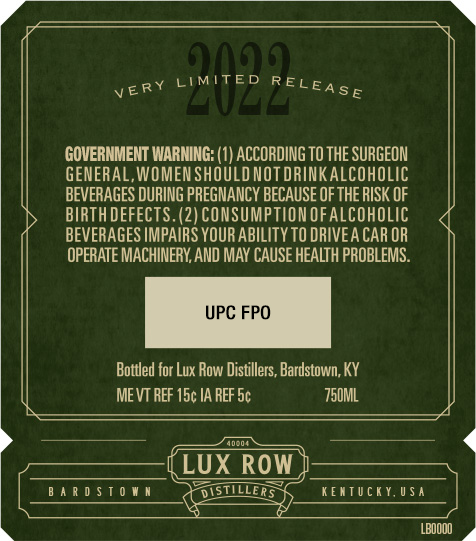
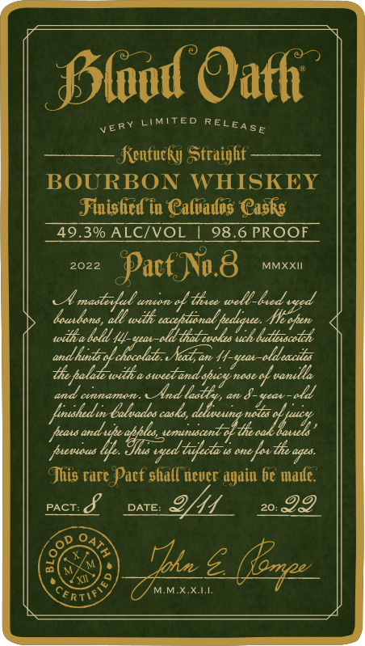
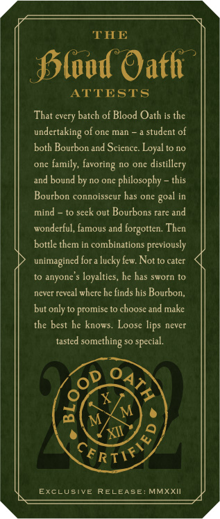

# TTB COLA Label Images - TTBID 21288001000078

**Brand Name:** BLOOD OATH

**Fanciful Name:** PACT NO. 8

**Issue Date:** 11/23/2021

**Origin Code:** 29

**Product Class/Type:** 641

**Source:** [TTB Public COLA Registry](https://ttbonline.gov/colasonline/viewColaDetails.do?action=publicFormDisplay&ttbid=21288001000078)

## Label Images

### Back Label

### Front Label

### Label 2

### Label 3

### Label 4

## Extracted Label Text

*Text extracted via OCR - may contain errors*

*1 image(s) excluded: text did not meet readability threshold*

**Detected Proof:** 98.6

### Back Label

01
2022
GOVERNMENT WARNING: (1) ACCORDING TO THE SURGEON
GENERAL,WOMEN SHOULD NOTdRINKalcohOLIC
BEVERAGES DURING PREGNANCY BECAUSE OF THE RISK OF
BIRTHDEFECTS. (2) CONSUMPTIONOFALCOHOLIC
BEVERAGES IMPAIRS YOUR ABILITY TO DRIVEA CAR OR
OPERATE MACHINERY AND MAY CAUSE HEALTH PROBLEMS .
UPC FPO
Bottled for Lux Row Distillers, Bardstown; KY
ME VT REF 15c IA REF Sc
750ML
mam
LUX ROW
B 4 R 0 $ T 0 W n
DISTILLER 5
KeTTUciUSa
LBOOOO
RELEASE
VERY

### Front Label

fslod Oath
LIMITED
Kentucky SStraight
BOURBON
WHISKEY
Jinisled in Calvados Casks
49.3% ALCIVOL
98.6 PROOF
2022
Pact Na.8
MMXXII
maotevul _
anen
dtiee well-
douadand,
wilh eceptonal f
Zzz
toiliv a bold 44
Ithat eakes
butbocatzh
22
Nead, an 44-
the
@dwectandafuca
nde
& vanella
and
cunnnau
~And
an 8-ueat-ald
funshedun Delvades cesks;
'alaesmg saa
peato
"aady Iaspaltpa #
'te
pxewauo
vged-titete % one faa Te agea:
Jhis rare Pact shall ncvcr again b€ madc.
PACT:
8
DATE:
20:
99
Tbu 5
MMXXL
{RT
RELEASE
VERY
%teat-cldeacilos
Yid'
aak
(6zp

### Label 2

THE
SSlood Oafh
ATTESTS
That every batch of Blood Oath is the
undertaking of one man
student of
both Bourbon and Science: Loyal t0 no
One
family, favoring no one distillery
and bound by no one philosophy
this
Bourbon connoisseur has one
mind
to seek out Bourbons rare and
wonderful, famous and forgotten: Then
bottle them in combinations previously
unimagined for =
lucky few: Not to cater
anyone
loyalties, he has sworn to
ncvcr rcvcal where hc finds his Bourbon,
but only to promise to choose and make
the best he knows;
Loose lips never
tasted
something =
special.
0
1
6
M
M
XII
EXCLUSIvE
RELEASE
MMXXI
goal
~RTIF &

### Label 4

VERY LIMITED RELEASE
NEVER TO BE MADE AGAIN
CfRTIY>
