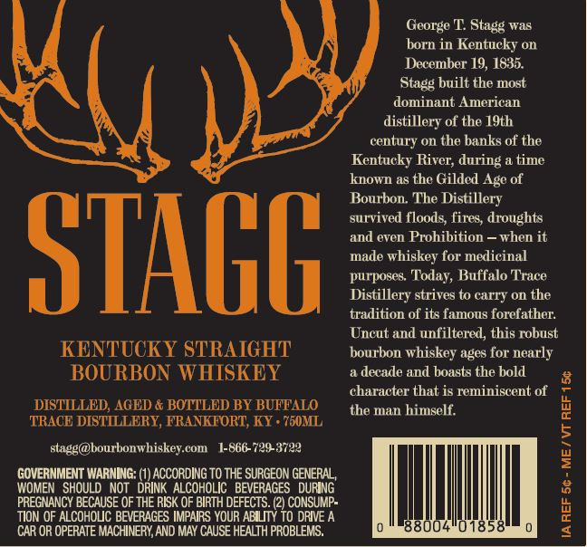
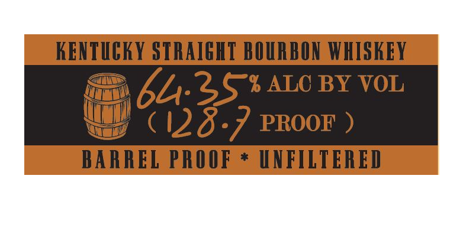

# TTB COLA Label Images - TTBID 21302001000316

**Brand Name:** STAGG

**Issue Date:** 11/02/2021

**Origin Code:** 22

**Product Class/Type:** 101

**Source:** [TTB Public COLA Registry](https://ttbonline.gov/colasonline/viewColaDetails.do?action=publicFormDisplay&ttbid=21302001000316)

## Label Images

### Back Label

### Front Label

## Extracted Label Text

*Text extracted via OCR - may contain errors*

**Detected Proof:** 128.7

### Back Label

George T Stagg was
born in Kentucky on
December 19, 1835.
Stagg built the most
dominant American
distillery of the 19th
century on the banks of the
Kentucky River;
a time
known as
Gilded Age of
Bourbon The Distillery
survived floods; fires, droughts
and even Prohibition
when it
STAGG
made whiskey for medicinal
purposes
Today, Buffalo Trace
Distillery strives to carry On the
tradition of its famous forefather:
Uncut and unfiltered, this robust
KENTUCKY STRAIGHT
bourbon whiskey ages for nearly
BOURBON WHISKEY
decade and boasts the bold
character that is reminiscent of
DISTILLED; AGED & BOTTLED BY BUFFALO
the man himself:
TRACE DISTILLERY, FRANKFORT;, KY . 7M0ML
1
stagg@dbourbonwhiskey com
1-866-729-3722
GOVERNMENT WARNING:
ACCORDING TO THE SURGEON GENERAL ,
WOMEN   SHOULD   NOT   DRINK  ALCOHOLIC   BEVERAGES   DURING
PREGNANCY BECAUSE OF THE RISK OF BIRTH DEFECTS. (2) CONSUMP:
TION OF ALCOHOLJC BEVERAGES IMPAIRS YOUR ABILITY TO DRIVE A
1
CAR OR OPERATE MACHINERY AND MAY CAUSE HEALTH PROBLEMS.
858
during
thc "

### Front Label

KENTUCKY STRAIGKT BOURBON WHISKEY
64.35%ALO BY VOL
(128.7 PROOF )
BARREL PROOF
UNFTLTERED
