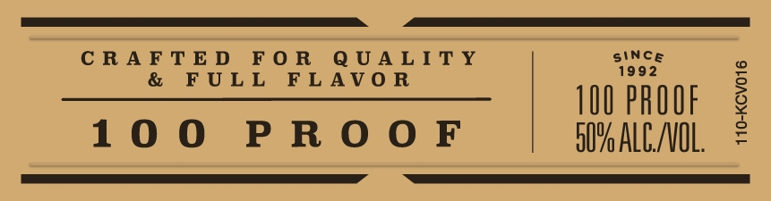
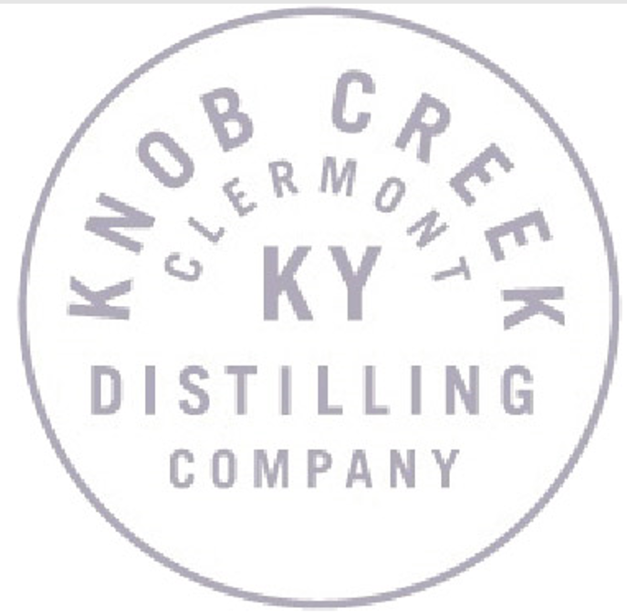

# TTB COLA Label Images - TTBID 21316001000389

**Brand Name:** KNOB CREEK

**Issue Date:** 11/16/2021

**Origin Code:** 22

**Product Class/Type:** 101

**Source:** [TTB Public COLA Registry](https://ttbonline.gov/colasonline/viewColaDetails.do?action=publicFormDisplay&ttbid=21316001000389)

## Label Images

### Label 1

### Label 2

### Label 3

### Label 4

## Extracted Label Text

*Text extracted via OCR - may contain errors*

*1 image(s) excluded: text did not meet readability threshold*

**Detected Proof:** 100
**Detected Age:** 18 Years

### Label 1

>>

LIMITED /E DITION

_

2\

CR

»; ramet

ey

= &

Soy eS

‘2

QUALITY

= hy

STD

KNOB

©:

CREEK

>=

A)

KENTUCKY STRAIGHT

AGED

TASTING NOTES

Full bodied

BOURBON WHISKEY

EIGHTEEN

caramelized oak

oS

RELEASE NO/

DSP/

with hints of sweet

KY-230

18

YEARS

baking spices

izle

### Label 2

CRAFTED FOR QUALITY

ULL FLAVOR

siNce

1992

100 PROOF

100 PROOF

B07 ALC/VOL.

### Label 3

Knob Creek 18 is unfiltered We quality screen for barrel char pieces; but the rest we keep intact It's part of what
gives Whiskey its
flavor and refined character;
also means that in low temperatures you might see
particles or a little
Sgugneavofieraalefinedcharnacfeze; ana
means your 100 proof is 1O0% as it should be,
GOVERNMENTWARNING: (7) ACCORDING TO THE SURGEON GENERAL; WOMEN ShOULD
HOT  DRINK ALCOHOLIC BEVERAGES DURING pREGHANCY BECAUSE OF THE RISK OF
BIRTH DEFEcts. (2) CONSUMPTHON OF ALCOhOLIC BEVERAGES HMPAHRS YOUR AbIL:
ITV TO DRIVE A CAR OR OPERATE MACHINERY; AND Mav CAUSE HEALTH PROBLEMS.
Per 1.5 fl, 0Z.
Average Analysis: Calories 122.0, Carbohydrates 0.Og, Protein Og, Fat Og
750 mL
50% ALC_IVOL;
DISTILLED AND BOTTLED BV
1
KNOB CREEK DISTILLING COMPANy;
CLERMONT, KENTUCKY
WWW KNOBCREEK.COM
ME VT REF 154
2
WWW_DRINKSMART. COM
IA REF 54
'80686"03508'
2
