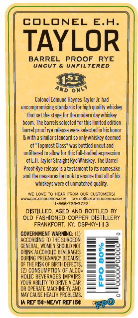
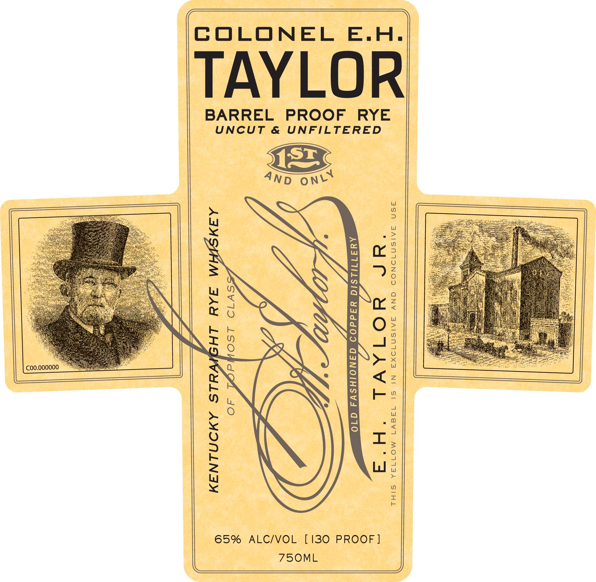
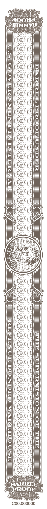

# TTB COLA Label Images - TTBID 21333001000225

**Brand Name:** COLONEL E.H. TAYLOR

**Issue Date:** 12/14/2021

**Origin Code:** 22

**Product Class/Type:** 102

**Source:** [TTB Public COLA Registry](https://ttbonline.gov/colasonline/viewColaDetails.do?action=publicFormDisplay&ttbid=21333001000225)

## Label Images

### Back Label

### Label 1

### Label 3

## Extracted Label Text

*Text extracted via OCR - may contain errors*

*2 image(s) excluded: text did not meet readability threshold*

### Back Label

COLONEL
E.A.
TAYLOR
BARREL
PROOF
RYE
UnCUT
UnFILTERED
JS2
ND
Colonel Edmund Haynes Taylor Jr had
uncompromising standards forhigh quality whiskyy
that set the stag? for tne modern day whiskey
boom The barrels selected forthis limite d edition
barre| proof gye release were selectedIn his honor
& with :
similar standard so onlywhiskey deemed
of "Topmost Class" was bottled uncut and
unfiltered to allow for this full-bodied expression
ofEH Taylor Straight Rye Whiskey. The Barrel
Proof Rye release is a testamenttoits namesake
and the measures he took to ensure that all of his
whiskeys were of unmatched quality.
WE LovE To Hz4R
TR3" QuR custc"eR5
Mn-AdAMZOUREcN C 4
TAYLCRAEREAmBOUrzon,CCM
1-8667725-3722
DISTILLED
AGED ANJ EOTTLED BY
OLD FASHIONED COPPE? DISTILLERY
FRANKFORT; Ky
DSP-KY-//3
GOVERNMENT WARNING: (1)
ACCORLING T0 THE SURCEOY
GENERAL, WOMEN ShOULD NOT
DRINA ALCOF OJC BEVERAGES
duNc PRecNancy BECAUSE
8
0F THE FIsk @F Blrth DEFECTS
{2) CONSUMPTION OF AlCO-
HOLC BEVERAGES IMPAIRS
YOUR ABILITY [0 DRME
C4R
CR OPERATE VACHINERY And
May ChUSE HzaLTH FROBLEWS
REF 54-MENT RBF 150
RPo
