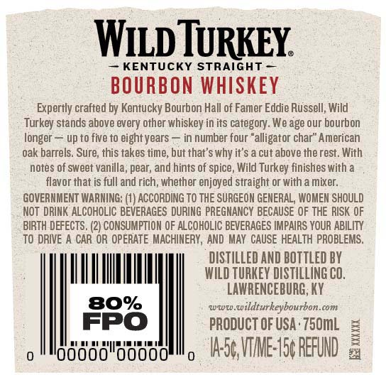
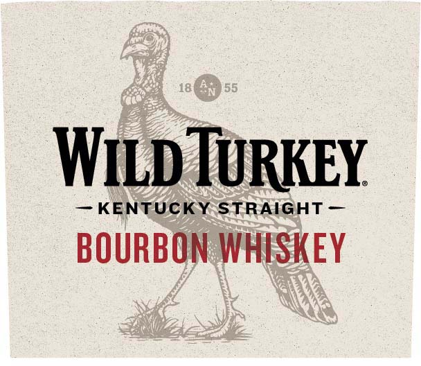
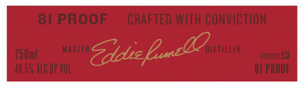
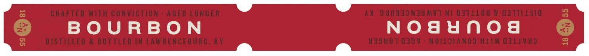

# TTB COLA Label Images - TTBID 21337001000453

**Brand Name:** WILD TURKEY

**Fanciful Name:** 81 PROOF

**Issue Date:** 12/07/2021

**Origin Code:** 22

**Product Class/Type:** 101

**Source:** [TTB Public COLA Registry](https://ttbonline.gov/colasonline/viewColaDetails.do?action=publicFormDisplay&ttbid=21337001000453)

## Label Images

### Back Label

### Front Label

### Label 3

### Label 4

## Extracted Label Text

*Text extracted via OCR - may contain errors*

*1 image(s) excluded: text did not meet readability threshold*

**Detected Proof:** 80

### Back Label

WipTRKEY
KENTUCKY STRAIGHT
BOURBON WHISKEY
Expertly crafted by Kentucky Bourbon Hall of Famer Eddie Russell; Wild
Turkey stands above every other whiskey in its category. We age our bourbon
longer:
up t0 five t0 eight years
in number four "alligator char" American
oak barrels. Sure, this takes time, but that's why ir's a cut above the rest. With
notes of sweet vanilla; pear; and hints of spice, Wild Turkey finishes with
flavor that is full and rich; whether enjoyed straight or With a mixer.
GOVERNMENT WARNING: (1) ACCORDING TO THE SURGEON GENERAL, WOMEN SHOULD
Not DRINK ALCOHOLIC BEVERAGES DURING PREGHANCY BECAUSE OF THE RISK OF
BIRTH DEFECTS . (2} CONSUMPTION OF ALCOHOLIC BEVERAGES IMPAIRS YOUR ABILITY
To DRIVE A CAR OR OPERATE MACHINERY , AND MAY CAUSE HEALTH PROBLEMS
DISTILLED AND BOTTLeD BY
WILD TURKEY DISTILLING CO,
LAWRENCEBURG; KY
80%
wwuw wildturkeybourbon.com
FPO
PRODUCT OF USA ' 750mL
IAsc VME:|5 REFUND

### Front Label

WILD TURKEY

KENTUCKY STRAIGHT

BOURBON WHISKEY

### Label 3

84 PROOF
CRAFTED WITH CONVICTION
75Umle
Master
'Zdekx '
'distiller
000o00 %9
4U,5X ALC BY VOL
04 PROOF
