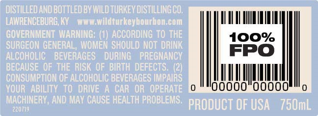
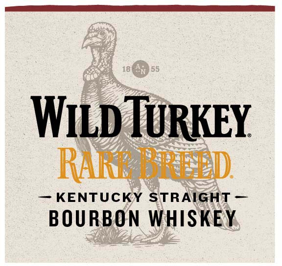
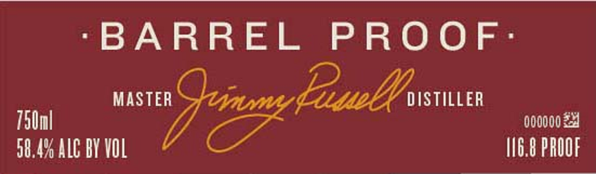

# TTB COLA Label Images - TTBID 21337001000508

**Brand Name:** WILD TURKEY

**Fanciful Name:** RARE BREED

**Issue Date:** 12/08/2021

**Origin Code:** 22

**Product Class/Type:** 101

**Source:** [TTB Public COLA Registry](https://ttbonline.gov/colasonline/viewColaDetails.do?action=publicFormDisplay&ttbid=21337001000508)

## Label Images

### Back Label

### Front Label

### Label 2

### Label 4

## Extracted Label Text

*Text extracted via OCR - may contain errors*

### Back Label

CUI

100%

FP

Il

|

oO

000

un

oom™o

### Front Label

WILD TURKEY

REC).

KENTUCKY STRAIGHT

“BOURBON WHISKEY,

### Label 2

‘BARREL PROOF:

MASTE

000000 24

" r ALC BY VOL

116.8 PROOF

icacececcecesee ML II,

### Label 4

DISTILLED AND BOTTLED BY

No4

116.8

WILD TURKEY DISTILLING CO.

CHAR :

BARREL PROOF

LAWRENCEBURG, KY
