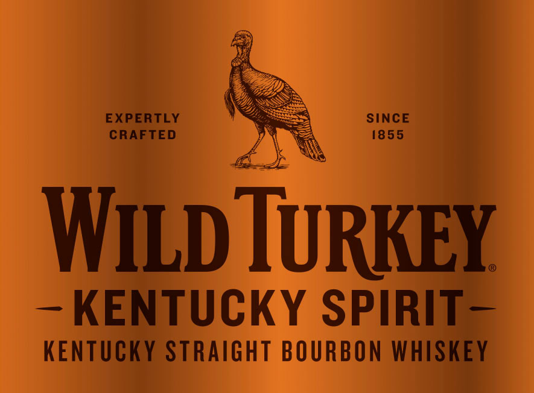
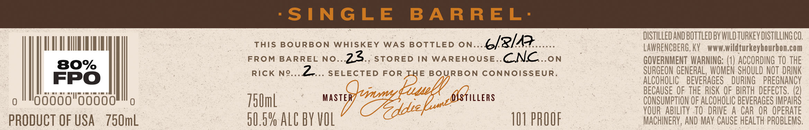
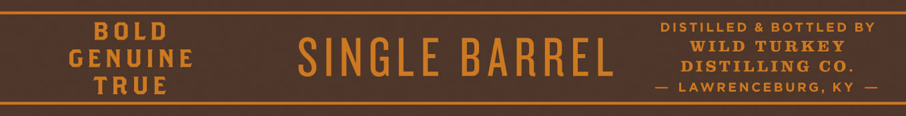

# TTB COLA Label Images - TTBID 21341001000246

**Brand Name:** WILD TURKEY

**Fanciful Name:** KENTUCKY SPIRIT

**Issue Date:** 12/07/2021

**Origin Code:** 22

**Product Class/Type:** 101

**Source:** [TTB Public COLA Registry](https://ttbonline.gov/colasonline/viewColaDetails.do?action=publicFormDisplay&ttbid=21341001000246)

## Label Images

### Front Label

### Label 2

### Label 3

## Extracted Label Text

*Text extracted via OCR - may contain errors*

**Detected Proof:** 80

### Front Label

EXPERTLY
SINCE
CRAFTED
1855
WiLd TuRKEY
KENTUCKY SPIRIT
KENTUCKY StraiGht BOURBON WHISKEY

### Label 2

SINGLE
B A R REL'
DISTILLED AND BOTTLED BY WILD tuRKEV DISTILLING CO;
This BOURBON
WhISKEY
WAS
BOTTLED ON
6/2/43
LAWRENCBERG, KY
WWW;
wildturkeybourbon com
FRoM
BARREL No
23
STORED
IN
WAREHOUSE
CNC
.ON
GOVERNMENT  WARNING: (1) ACCORDING TO THE
80%
RicK
N9_
2
SELECTED FOR THE BOURBON ConnOIssEUR.
SURGEON GENERAL,  WOMEN SHOULD NOT  DRINK
FPO
ALCOHOLIC
BEVERAGES
DURING
PREGNANCY
Yummy=
Pnell
BECAUSE OF THE  RISK QF   BIRTH DEFECTS, (2)
0
758mL
MaStER
DSTILLERS
CONSUMPTHON OF ALCOHOLIC BEVERAGES IMPAIRS
YOUR   ABILITY  to  DRIVE A
CAR   OR   OPERATE
PRODUCT OF USA
750mL
50.5% AlC BY VOL
10I PROOF
MACHINERY, AND May CAUSE HEALTh PROBLEMS,
ZddreEn.s

### Label 3

BOLD
DISTILLED
& BOTTLED
BY
WILD
TURKEY
GENUINE
SINGLE BARREL
DISTILLING C0 _
TRUE
LAWRENCEBURG, KY
