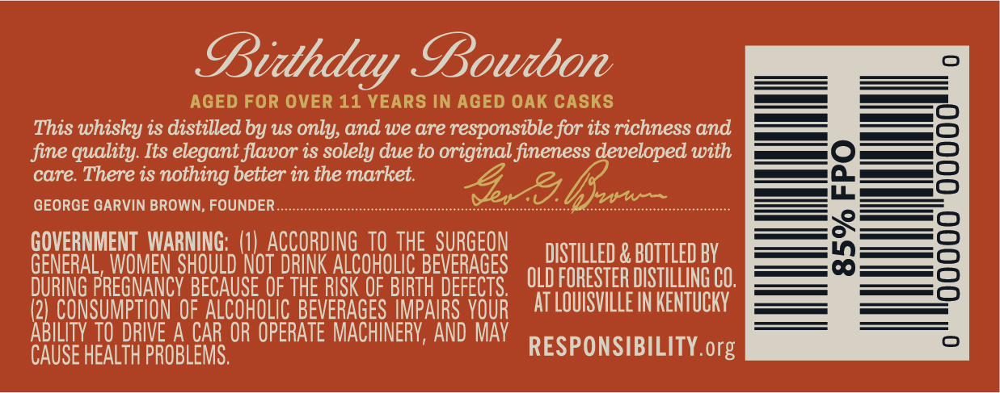
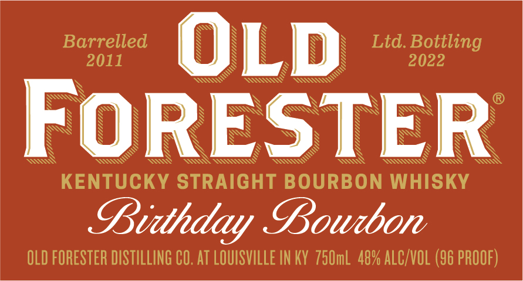
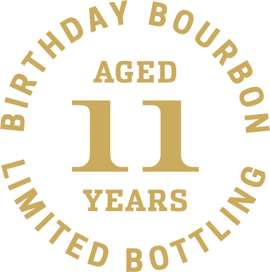
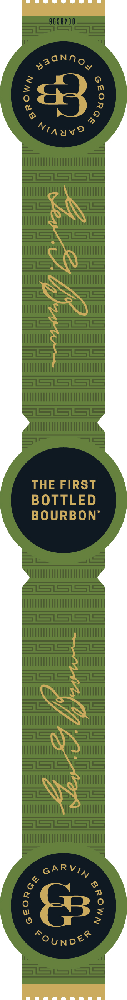

# TTB COLA Label Images - TTBID 21341001000628

**Brand Name:** OLD FORESTER

**Fanciful Name:** BIRTHDAY BOURBON 2022

**Issue Date:** 12/08/2021

**Origin Code:** 22

**Product Class/Type:** 101

**Source:** [TTB Public COLA Registry](https://ttbonline.gov/colasonline/viewColaDetails.do?action=publicFormDisplay&ttbid=21341001000628)

## Label Images

### Back Label

### Front Label

### Label 3

### Label 4

### Label 5

## Extracted Label Text

*Text extracted via OCR - may contain errors*

*3 image(s) excluded: text did not meet readability threshold*

**Detected Proof:** 96
**Detected Age:** 11 Years

### Back Label

B

Bourbon

AGED FOR OVER 11 YEARS IN AGED OAK CASKS

This whisky is distilled by us only, and we are responsible for its richness and

fine quality. Its elegant flavor is solely due to original fineness developed with

care. There is nothing better in the market.

GEORGE GARVIN BROWN, FOUNDER

bessneellh ett (1) aE 101 THE SURGEON

DISTILLED & BOTTLED BY

GEN

HOU nl NOT silks ALCOHOLIC BEVERAGES

OLD FORESTER DISTILLING CO.

DURING FPRESNANCY BECAI

USE OF TH

E RISK 0

BIRTH DEFEI

ABILITY TO DRIVE A CAR OR OPERATE MACHINERY, AND MAY

(2) CONSUMPTION OF ALCOHOLIC BEVE RAGES IMPAIRS YOUR AT LOUISVILLE IN KENTUCKY

CAUSE HEALTH PROBLEM

RESPONSIBILITY. org

### Front Label

Barrelled
OLD
Ltd Bottling
2011
2022
FORESTER
KENTUCKY STRAIGHT BOURBON WHISKY
Bitthday Bowdbon
OLD FORESTER DISTILLING CO, AT LOUISVILLE IN KY  75OmL 48% ALC/VOL (96 PROOF)
