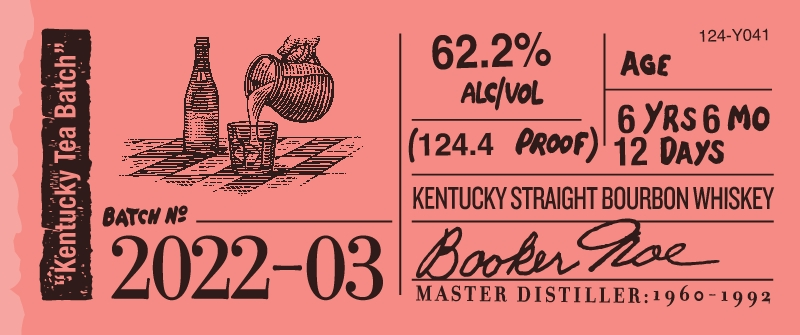

# TTB COLA Label Images - TTBID 21341001000704

**Brand Name:** BOOKER'S

**Issue Date:** 12/08/2021

**Origin Code:** 22

**Product Class/Type:** 101

**Source:** [TTB Public COLA Registry](https://ttbonline.gov/colasonline/viewColaDetails.do?action=publicFormDisplay&ttbid=21341001000704)

## Label Images

### Label 1

### Label 2

### Label 3

### Label 4

## Extracted Label Text

*Text extracted via OCR - may contain errors*

*1 image(s) excluded: text did not meet readability threshold*

**Detected Proof:** 124.4

### Label 1

Boob

De Whiithyy ste thes plochege 0

—_

polighes

one Hire offlim Learn ifr

pica

Sotihd wipers (rds un f Line

Gy gmt, in Lean bh heis

Mtiihiy from Ai 70 Ligh Geen

=<

aE Sse

### Label 2

124-Y041
62.2%
AGe
3
AlcIvol
6 YRs6 Mo
2
(124.4 PRoor) 12 DAYS
KeNTUCKY STRAIGHT BOURBON WHISKEY
0
BATCH N?
Goe
2022-03
MASTER
BBooes"
DISTILLER:1960-1992

### Label 3

BOOKER'S® KENTUCKY STRAIGHT BOURBON WHISKEY
DISTILLED AND BOTTLED BY JAMES B. BEAM DISTILLING CO.
CLERMONT, KENTUCKY

GOVERNMENT WARNING:(1) ACCORDING T0 mma
THE SURGEON GENERAL, WOMEN SHOULD

NOT DRINK ALCOHOLIC BEVERAGES DURING

PREGNANCY BECAUSE OF THE RISK

OFBIRTH DEFECTS. (2) CONSUMPTION OF

ALCOHOLIC BEVERAGES IMPAIRS YOUR

ABILITY TO DRIVE A CAR OR OPERATE MACHIN

HAY AO WAN CAUSE WEALTH PROBES WMA ociIna aac .
ME VT REF 15¢ * IA REF 5¢ $a
