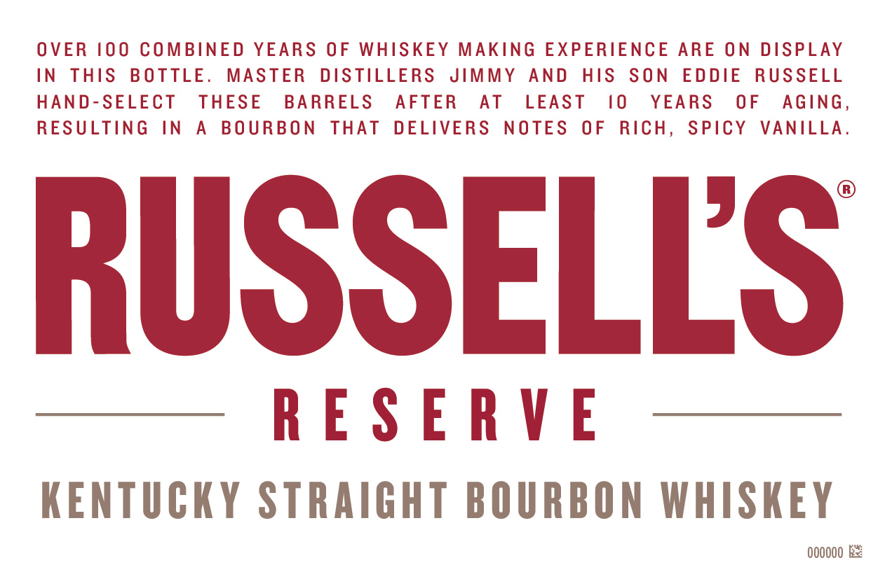
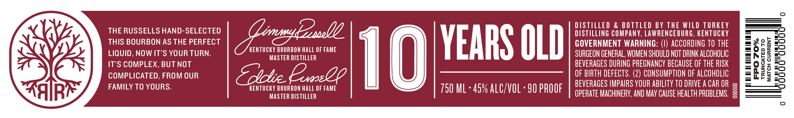
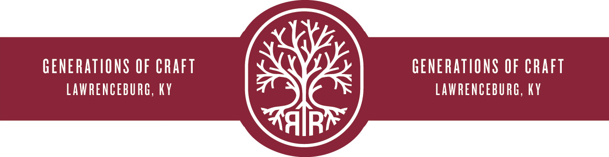

# TTB COLA Label Images - TTBID 22014001000233

**Brand Name:** RUSSELL'S RESERVE

**Fanciful Name:** 10 YEARS OLD

**Issue Date:** 02/01/2022

**Origin Code:** 22

**Product Class/Type:** 101

**Source:** [TTB Public COLA Registry](https://ttbonline.gov/colasonline/viewColaDetails.do?action=publicFormDisplay&ttbid=22014001000233)

## Label Images

### Front Label

### Label 1

### Label 3

## Extracted Label Text

*Text extracted via OCR - may contain errors*

*1 image(s) excluded: text did not meet readability threshold*

### Front Label

OVER 100 COMBINED YEARS OF WHISKEY MAKING EXPERIENCE ARE ON DISPLAY

IN THIS BOTTLE. MASTER DISTILLERS JIMMY AND HIS SON EDDIE RUSSELL

HAND-SELECT THESE BARRELS AFTER AT LEAST 10 YEARS OF AGING

RESULTING IN A BOURBON THAT DELIVERS NOTES OF RICH, SPICY VANILLA

RUSSELLS

RESERVE

KENTUCKY STRAIGHT BOURBON WHISKEY

000000 Re

### Label 1

THE RUSSELLS HAND-SELECTED

THIS BOURBON AS THE PERFECT
. KENTUCKY BOURBON HALL OF FAME

LIQUID, NOW IT’S YOUR TURN. MASTER DISTILLER

IT’S COMPLEX, BUT NOT

COMPLICATED, FROM OUR

FAMILY TO YOURS. KENTUCKY BOURBON HALL OF FAME
MASTER DISTILLER

10

YEARS OLD

750 ML - 45% ALC/VOL - 90 PROOF

DISTILLED & BOTTLED BY THE WILD TURKEY
DISTILLING COMPANY, LAWRENCEBURG, KENTUCKY

GOVERNMENT WARNING: (1) ACCORDING TO THE
SURGEON GENERAL, WOMEN SHOULD NOT DRINK ALCOHOLIC
BEVERAGES DURING PREGNANCY BECAUSE OF THE RISK
OF BIRTH DEFECTS. (2) CONSUMPTION OF ALCOHOLIC
BEVERAGES IMPAIRS YOUR ABILITY 10 DRIVE ACAROR s
OPERATE MACHINERY, AND MAY CAUSE HEALTH PROBLEMS. 3

FPO 70%

TRUNCATED TO
