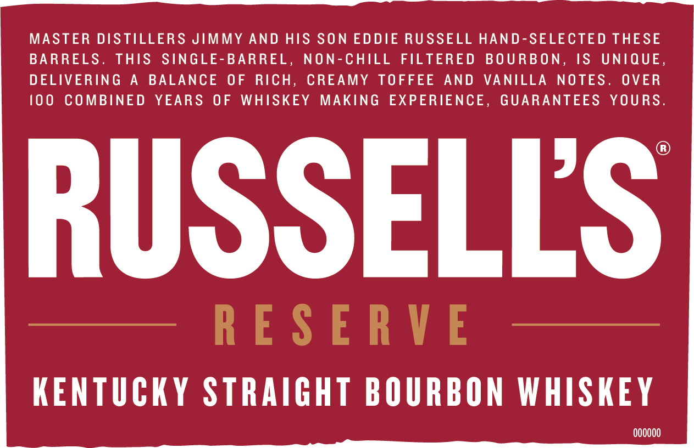
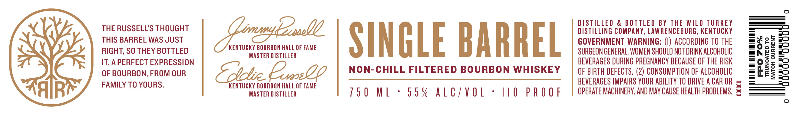
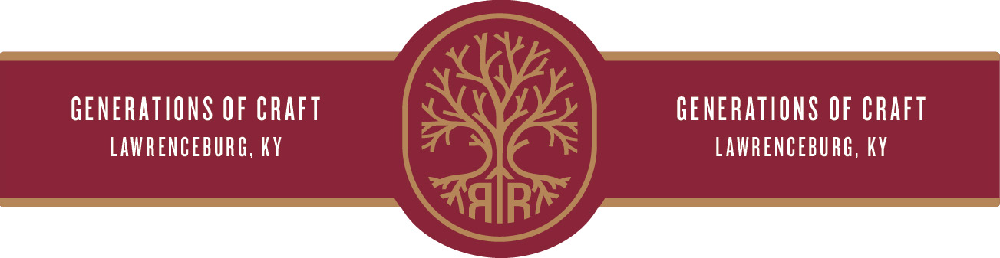

# TTB COLA Label Images - TTBID 22014001000277

**Brand Name:** RUSSELL'S RESERVE

**Fanciful Name:** SINGLE BARREL

**Issue Date:** 02/01/2022

**Origin Code:** 22

**Product Class/Type:** 101

**Source:** [TTB Public COLA Registry](https://ttbonline.gov/colasonline/viewColaDetails.do?action=publicFormDisplay&ttbid=22014001000277)

## Label Images

### Front Label

### Label 1

### Label 3

## Extracted Label Text

*Text extracted via OCR - may contain errors*

*1 image(s) excluded: text did not meet readability threshold*

**Detected Proof:** 110

### Front Label

eee Set Sarees

MASTER DISTILLERS JIMMY AND HIS SON EDDIE RUSSELL HAND-SELECTED THESE
BARRELS. THIS SINGLE-BARREL, NON-CHILL FILTERED BOURBON, IS UNIQUE,
DELIVERING A BALANCE OF RICH, CREAMY TOFFEE AND VANILLA NOTES. OVER
{00 COMBINED YEARS OF WHISKEY MAKING EXPERIENCE, GUARANTEES YOURS.

RUSSELLS

KENTUCKY STRAIGHT BOURBON WHISKEY

000000

### Label 1

THE RUSSELL'S THOUGHT
THIS BARREL WAS JUST
RIGHT, SO THEY BOTTLED
IT. APERFECT EXPRESSION
OF BOURBON, FROM OUR
FAMILY TO YOURS.

KENTUCKY BOURBON HALL OF FAME
MASTER DISTILLER

KENTUCKY BOURBON HALL OF FAME
MASTER DISTILLER

SINGLE BARREL

NON-CHILL FILTERED BOURBON WHISKEY

750 ML + 55% ALC/VOL:

110 PROOF

DISTILLED & BOTTLED BY THE WILD TURKEY
DISTILLING COMPANY, LAWRENCEBURG, KENTUCKY
GOVERNMENT WARNING: (I) ACCORDING TO THE
SURGEON GENERAL, WOMEN SHOULD NOT DRINK ALCOHOLIC
BEVERAGES DURING PREGNANCY BECAUSE OF THE RISK
OF BIRTH DEFECTS. (2) CONSUMPTION OF ALCOHOLIC
BEVERAGES IMPAIRS YOUR ABILITY TO DRIVE ACAR OR =
OPERATE MACHINERY, AND MAY CAUSE HEALTH PROBLEMS. 3

00

iN

sat

FPO 70%

I
