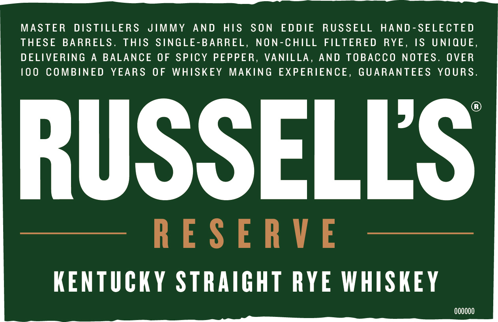
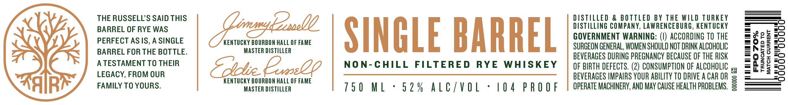

# TTB COLA Label Images - TTBID 22031001001080

**Brand Name:** RUSSELL'S RESERVE

**Fanciful Name:** SINGLE BARREL

**Issue Date:** 02/03/2022

**Origin Code:** 22

**Product Class/Type:** 102

**Source:** [TTB Public COLA Registry](https://ttbonline.gov/colasonline/viewColaDetails.do?action=publicFormDisplay&ttbid=22031001001080)

## Label Images

### Front Label

### Label 2

### Label 3

## Extracted Label Text

*Text extracted via OCR - may contain errors*

*1 image(s) excluded: text did not meet readability threshold*

**Detected Proof:** 104

### Front Label

MASTER
DISTILLERS
JIMMY
AND
HIS
SON
EDDIE
RUSSELL
HAND- SELECTED
THESE BARRELS .
ThIS SINGLE-BARREL,
NON-CHILL FILTERED
RYE ,
IS
UNIQUE,
DELIVERING
A
BALANCE
OF SPICY PEPPER,
VANILLA ,
AND TOBACCO NOTES.
OVER
10 0
COMBINED
YEARS
0F
WHISKEY
MAKING
EXPERIENCE ,
GUARANTEES
YOURS.
RUSSELLS
R E $ E R V E
KENTUCKY STRAIGHT RYE WHISKEY
0OOOOO

### Label 2

THE RUSSELL'S SAID THIS
BARREL OF RYE WAS
PERFECT ASIS, A SINGLE
BARREL FOR THE BOTTLE.
A TESTAMENT TO THEIR
LEGACY, FROM OUR
FAMILY TO YOURS.

KENTUCKY BOURBON HALL OF FAME
MASTER DISTILLER

KENTUCKY BOURBON HALL OF FAME
MASTER DISTILLER

SINGLE BARREL

NON-CHILL FILTERED RYE WHISKEY

750 ML + 52% ALC/VOL - 104 PROOF

DISTILLED & BOTTLED BY THE WILD TURKEY
DISTILLING COMPANY, LAWRENCEBURG, KENTUCKY
GOVERNMENT WARNING: (I) ACCORDING TO THE
SURGEON GENERAL, WOMEN SHOULD NOT DRINK ALCOHOLIC
BEVERAGES DURING PREGNANCY BECAUSE OF THE RISK
OF BIRTH DEFECTS. (2) CONSUMPTION OF ALCOHOLIC .y
BEVERAGES IMPAIRS YOUR ABILITY TO DRIVE ACAR OR =

Ss

OPERATE MACHINERY, AND MAY CAUSE HEALTH PROBLEMS. 3

FPO 70%

TRUNCATED TO
