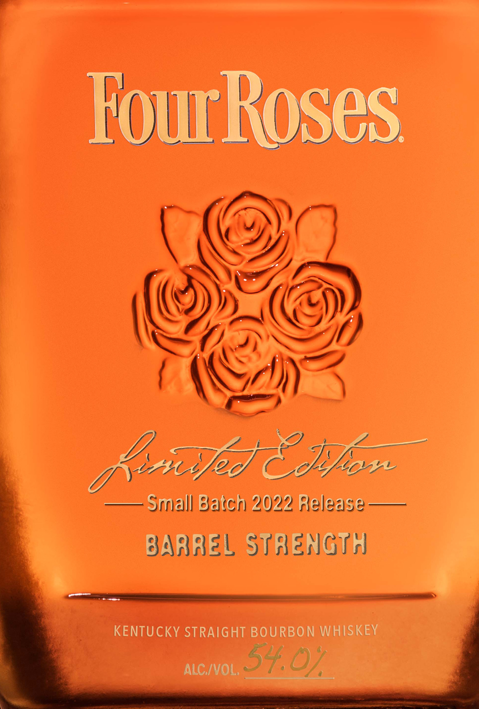
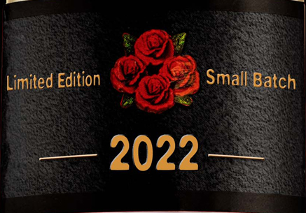
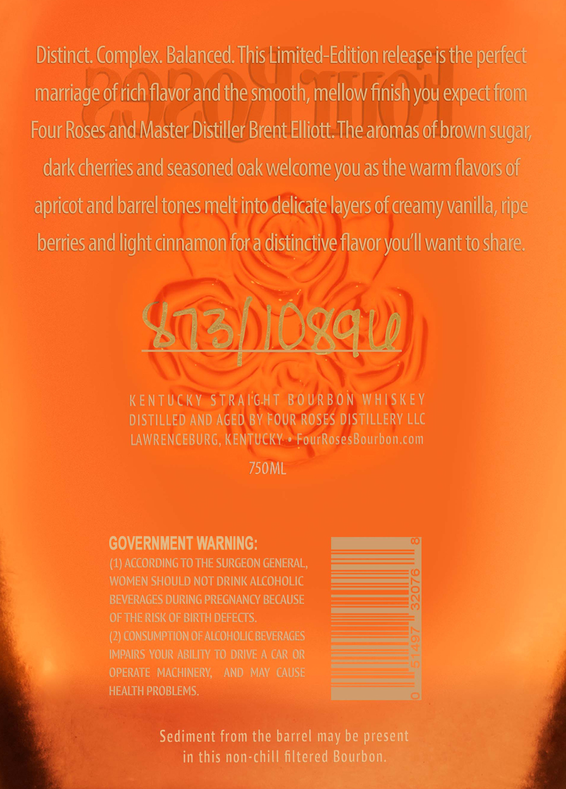

# TTB COLA Label Images - TTBID 22049001000784

**Brand Name:** FOUR ROSES

**Fanciful Name:** LIMITED EDITION SMALL BATCH

**Issue Date:** 03/08/2022

**Origin Code:** 22

**Product Class/Type:** 101

**Source:** [TTB Public COLA Registry](https://ttbonline.gov/colasonline/viewColaDetails.do?action=publicFormDisplay&ttbid=22049001000784)

## Label Images

### Label 1

### Label 2

### Label 3

## Extracted Label Text

*Text extracted via OCR - may contain errors*

*1 image(s) excluded: text did not meet readability threshold*

### Label 1

FouRoses
Ouf] 8 Jfo
Srall Batch 2022 Release
BARREL STaENGTH
KENTUCKY STRAIGHT BOURBON WHISKEY
ALC /VOL;
SK,02

### Label 3

Distinct. Complex. Balanced. This Limited-Edition release is the perfect
Marriage of rich flavor and the smoothy mellow finish you expect trom
Four Roses and Master Distiller Brent Elliott. The aromas of brownsugar,
dark cherries and seasoned oak welcome you as the warm flavors oF
apricot and barrel tones melt into delicate layers of creamy vanilla, ripe
berties and light cinnamon fora distinctive flavor you'll want to share:

KENTUCKYeSTRAIGHT BOURBON WHISKEY
DISTILLED AND AGED BY FOUR ROSES DISTILLERY LLC
LAWRENCEBURG, KENTUCKY *FourRosesBourbon.com

750ML

GOVERNMENT WARNING:

(1) ACCORDING TO THE SURGEON GENERAL,

WOMEN SHOULD NOT DRINK ALCOHOLIC

BEVERAGES DURING PREGNANCY BECAUSE

OF THE RISK OF BIRTH DEFECTS.

(2) CONSUMPTION OF ALCOHOLIC BEVERAGES
é IMPAIRS YOUR ABILITY TO DRIVE A CAR OR

OPERATE MACHINERY, AND MAY CAUSE

HEALTH PROBLEMS.

Sediment from the barrel may be present
in this non-chill filtered Bourbon, mes
