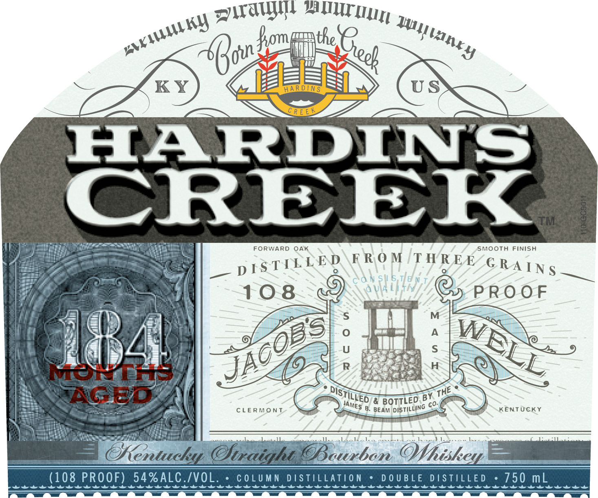
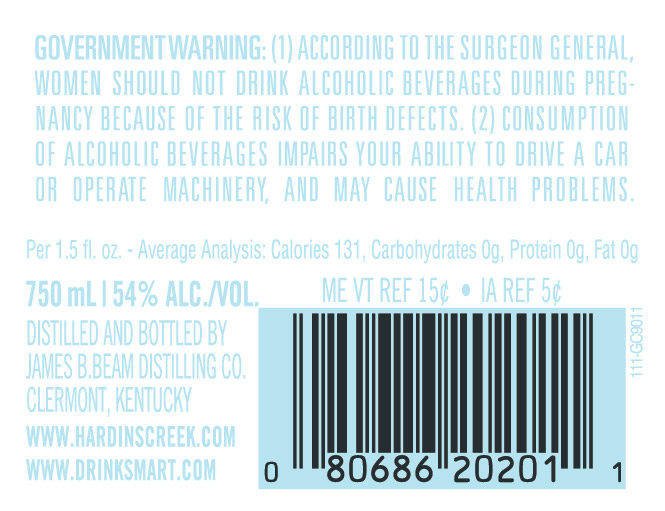
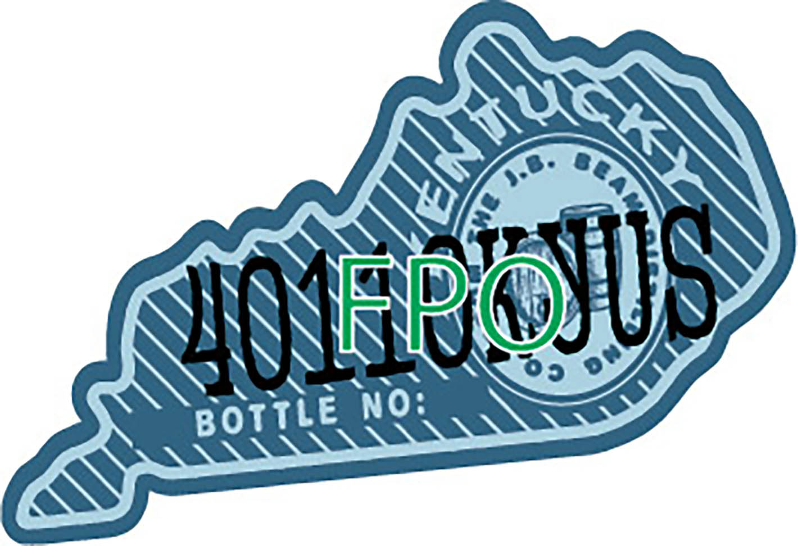
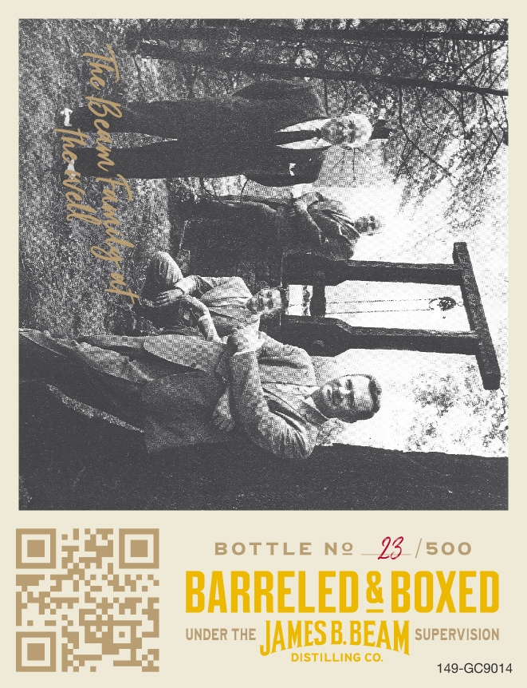

# TTB COLA Label Images - TTBID 22053001000495

**Brand Name:** HARDIN'S CREEK

**Issue Date:** 03/01/2022

**Origin Code:** 22

**Product Class/Type:** 101

**Source:** [TTB Public COLA Registry](https://ttbonline.gov/colasonline/viewColaDetails.do?action=publicFormDisplay&ttbid=22053001000495)

## Label Images

### Label 1

### Label 2

### Label 3

### Label 4

### Label 5

### Label 6

### Label 7

## Extracted Label Text

*Text extracted via OCR - may contain errors*

*6 image(s) excluded: text did not meet readability threshold*

### Label 3

Distilled and bottled by

FS BBEAM DISTILLING

Distillers Since 1795

JAY
