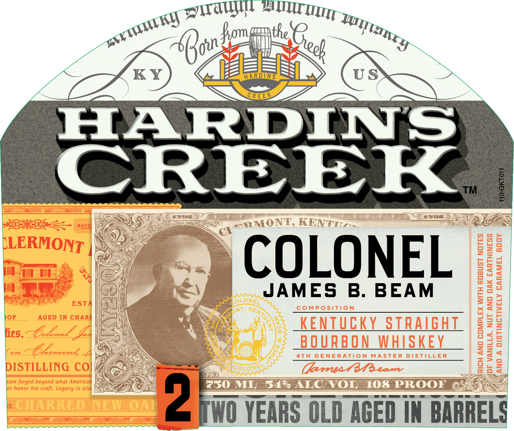
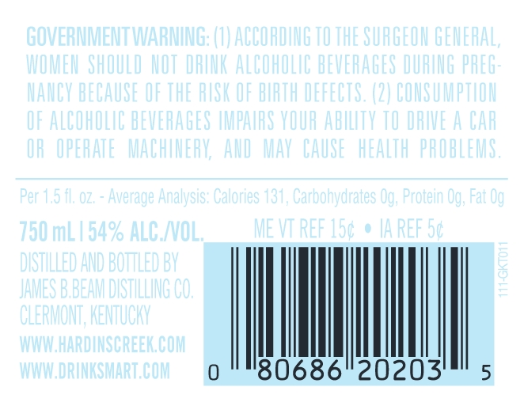
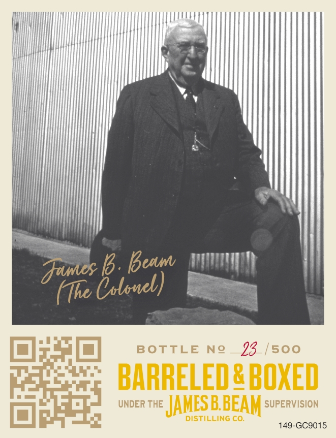

# TTB COLA Label Images - TTBID 22053001000519

**Brand Name:** HARDIN'S CREEK

**Issue Date:** 03/01/2022

**Origin Code:** 22

**Product Class/Type:** 101

**Source:** [TTB Public COLA Registry](https://ttbonline.gov/colasonline/viewColaDetails.do?action=publicFormDisplay&ttbid=22053001000519)

## Label Images

### Label 1

### Label 2

### Label 3

### Label 4

### Label 5

## Extracted Label Text

*Text extracted via OCR - may contain errors*

*3 image(s) excluded: text did not meet readability threshold*

### Label 1

Tra aT
KL) 1 ty
porn” fomprrthe : Tn
6 ous <A ‘aly ~ uy
Pa FS ES
KY) © Bess »» (US
HARDIN S
| 1 GESTS CazeEs 4 a E a tana = i Casax 5 COVES
Vay Ler - & =
ANS) er rT
Soe, E ; = \
| IER Ea
| 0) _@ =)... JAMES B. BEAM
WAN NR :
Nie OY O'S NRENIULRY oOTRAIGATL
oS aN DU™UtC<“<i<CS@
Kak WO YEARS OLD AGED IN BARRELS

### Label 5

DISTILLED AND BOTTLED BY

JAMESBBEAM

DISTILLING CO.
