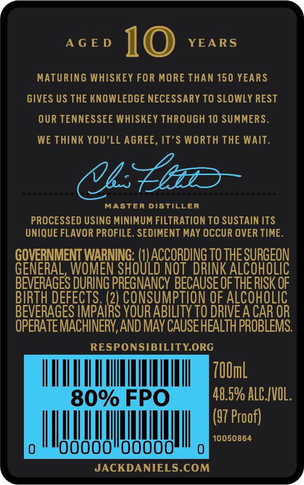
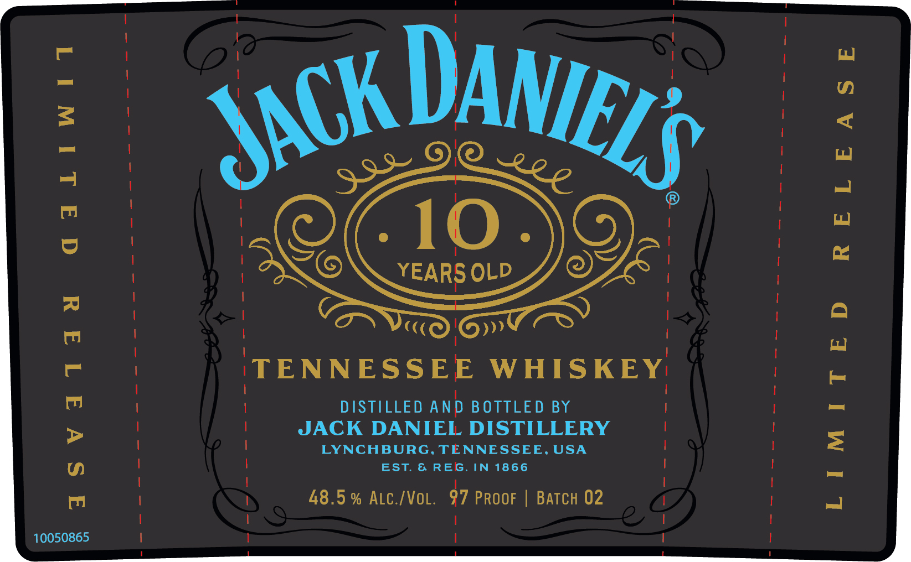

# TTB COLA Label Images - TTBID 22073001000708

**Brand Name:** JACK DANIEL'S

**Fanciful Name:** 10 YEARS OLD

**Issue Date:** 03/21/2022

**Origin Code:** 43

**Product Class/Type:** 140

**Source:** [TTB Public COLA Registry](https://ttbonline.gov/colasonline/viewColaDetails.do?action=publicFormDisplay&ttbid=22073001000708)

## Label Images

### Back Label

### Front Label

## Extracted Label Text

*Text extracted via OCR - may contain errors*

### Back Label

AGED 10 YEARS

MATURING WHISKEY FOR MORE THAN 150 YEARS

GIVES US THE KNOWLEDGE NECESSARY TO SLOWLY REST

OUR TENNESSEE WHISKEY THROUGH 10 SUMMERS

WE THINK YOU’LL AGREE, IT’S WORTH THE WAIT.

UC

MASTER DISTILLER

PROCESSED USING MINIMUM FILTRATION TO SUSTAIN ITS

UNIQUE FLAVOR PROFILE. SEDIMENT MAY OCCUR OVER TIME

coe wnt

NL raeittt

GENE

sate PN

DRINK Al

OLIC

BEVERAGES DURING PRESNANC! BECAUSE OF THERISK OF

BIRTH DEF

5. (2

CONSUMPTI

ALCOHOLIC

BEVERAGES IMPAI

x

YOUR ABILITY TO DRIVE A CAR OR

OPERATE MACHINERY, AND MAY CAUSE HEALTH PROBLEMS

RESPONSIBILITY.ORG

UTA A

700ml

48.5% ALCIVOL

(57 Proof)

mu

NM)

10050864

JACKDANIELS.COM

### Front Label

} ! i

| i

KDA

\S

ME

10

ENC

YEARS OLD

OE

|

C(

»»

|

TENNESSEE WHISKEY:

|

|

DISTILLED AND BOTTLED BY

|

JACK DANIEL DISTILLERY

LYNCHBURG, TENNESSEE, USA

EST. & REG. IN 1866

48.5% ALC./VOL. 97 PROOF | BATCH 02

|

10050865

|
