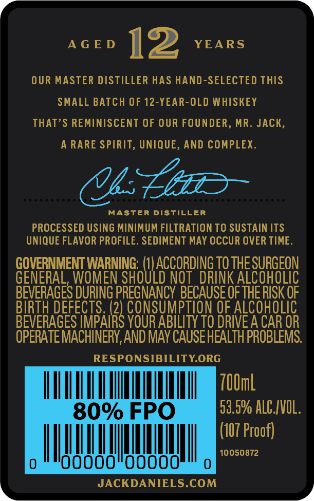
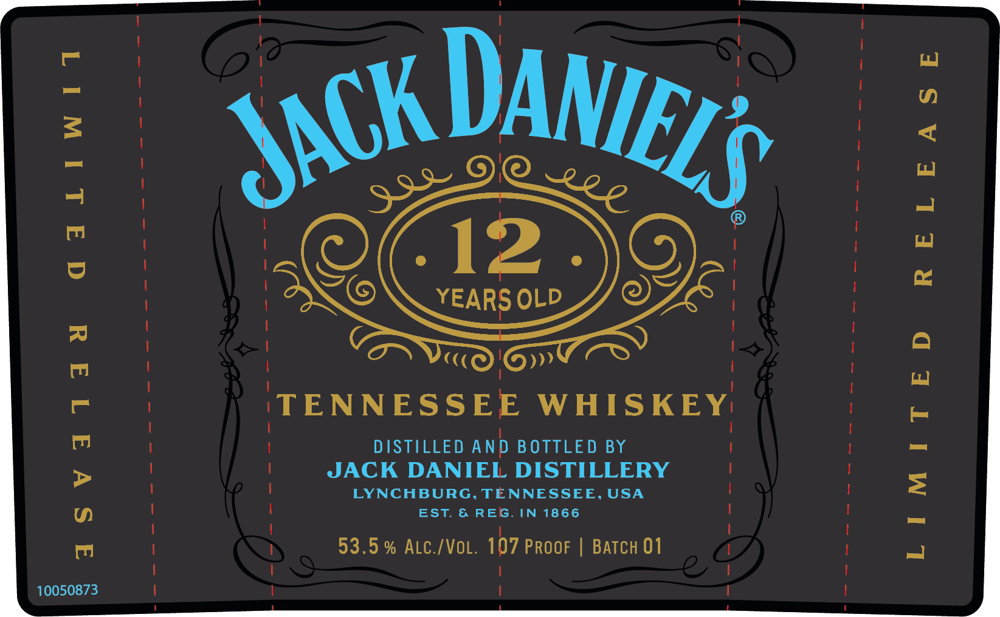

# TTB COLA Label Images - TTBID 22073001000711

**Brand Name:** JACK DANIEL'S

**Fanciful Name:** 12 YEARS OLD

**Issue Date:** 03/21/2022

**Origin Code:** 43

**Product Class/Type:** 140

**Source:** [TTB Public COLA Registry](https://ttbonline.gov/colasonline/viewColaDetails.do?action=publicFormDisplay&ttbid=22073001000711)

## Label Images

### Back Label

### Front Label

## Extracted Label Text

*Text extracted via OCR - may contain errors*

**Detected Proof:** 107
**Detected Age:** 12 Years

### Back Label

AGED 12 YEARS

OUR MASTER DISTILLER HAS HAND-SELECTED THIS

SMALL BATCH OF 12-YEAR-OLD WHISKEY

THAT’S REMINISCENT OF OUR FOUNDER, MR. JACK

A RARE SPIRIT, UNIQUE, AND COMPLEX

UC

MASTER DISTILLER

PROCESSED USING MINIMUM FILTRATION TO SUSTAIN ITS

UNIQUE FLAVOR PROFILE. SEDIMENT MAY OCCUR OVER TIME

coe wnt

RGEON

GENE

sate PN i THE SU

OLIC

BEVERAGES DURING PRESNANC! BECAUSE OF THERISK OF

BIRTH DEF

5. (2

CONS

Tl

ALCOHOLIC

BEVERAGES IMPAI

x

YOUR ABILITY TO DRIVE A CAR OR

OPERATE MACHINERY, AND MAY CAUSE HEALTH PROBLEMS

RESPONSIBILITY.ORG

UTA A

100ml

53.5% ALC.IVOL

(07 Proof)

mu

NM)

10050872

JACKDANIELS.COM

### Front Label

4
1
12
ee
1
YEARS OLD
TENNESSEE
WHISKEY
1
JACKSTAFVIAI DOSTELEERY
F
LYNCHBURG, TENNESSEE, USA
EST
REG_
IN
1866
53.5 % ALC /VoL. 107 PROOF
BATcH 01
10050873
DANIELS
JACK L
99
