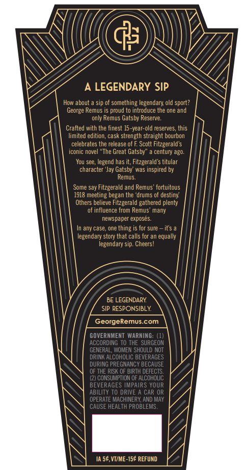
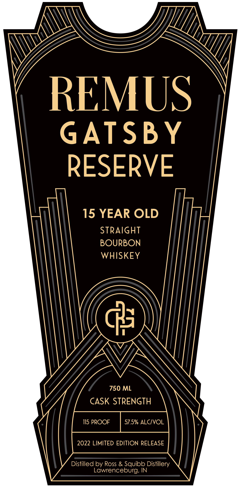

# TTB COLA Label Images - TTBID 22074001000848

**Brand Name:** REMUS

**Fanciful Name:** GATSBY RESERVE

**Issue Date:** 04/11/2022

**Origin Code:** 29

**Product Class/Type:** 101

**Source:** [TTB Public COLA Registry](https://ttbonline.gov/colasonline/viewColaDetails.do?action=publicFormDisplay&ttbid=22074001000848)

## Label Images

### Back Label

### Front Label

## Extracted Label Text

*Text extracted via OCR - may contain errors*

### Back Label

Y
Ay (( >)\ ’)
\\ Cha G
\\ : UY,
S A LEGENDARY SIP q
ee ea ets
Crafted with the finest 15-year-old reserves, this
imited edition, cask strength straight bourbon
eee
oe i A ae ‘the ie ate ing
Others nalahe Batts a is ve ty
In any case, one thing is for sure — it's a
Cee beer
N 1A S¢, VI/ME-15¢ REFUND 4

### Front Label

\\

\-Z-

NG

EMU

GATSBY

RESERVE

15 YEAR OLD

WHISKEY

(43)

SK STRENGTH

istilled by Ross & Squibb Distille
