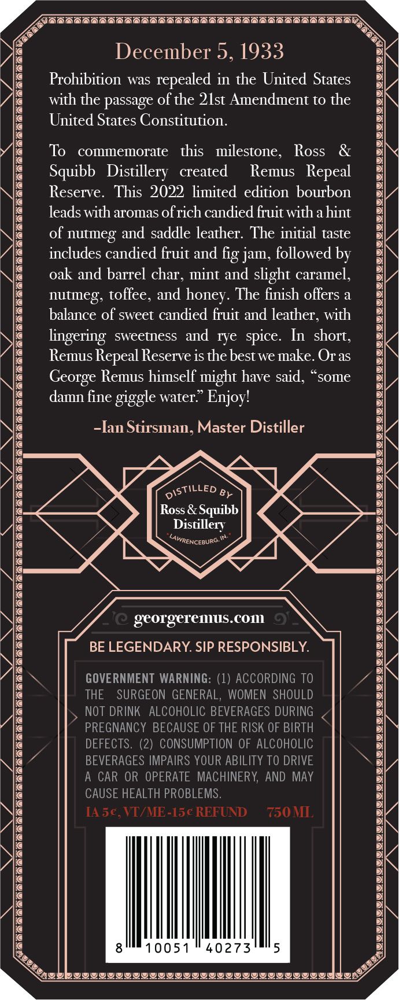
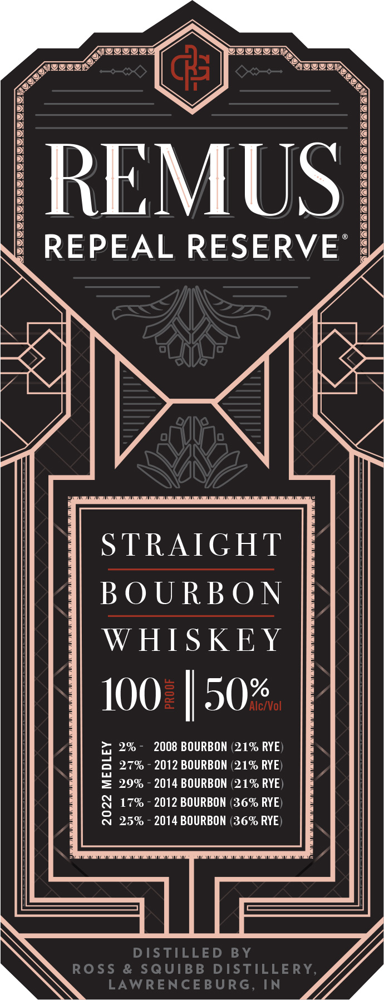

# TTB COLA Label Images - TTBID 22074001000858

**Brand Name:** REMUS

**Fanciful Name:** REPEAL RESERVE

**Issue Date:** 04/11/2022

**Origin Code:** 29

**Product Class/Type:** 101

**Source:** [TTB Public COLA Registry](https://ttbonline.gov/colasonline/viewColaDetails.do?action=publicFormDisplay&ttbid=22074001000858)

## Label Images

### Back Label

### Front Label

### Label 3

## Extracted Label Text

*Text extracted via OCR - may contain errors*

*1 image(s) excluded: text did not meet readability threshold*

**Detected Proof:** 100

### Back Label

December 5,1933
Prohibition was
in the United States
with the passage of the 2lst Amendment to the
United States Constitution.
To
commemorate
this   milestone,
Ross
Squibb   Distillery
created
Remus   Repeal
Reserve.  This 2022 limited edition bourbon
leads with aromas ofrich candied fiuit with ahint
of nutmeg and saddle leather: The initial taste
includes candied fruit and fig jam, followed by
oak and barrel char
mint and slight caramel
toffee, and
The finish offers
balance of sweet candied fiuit and leather; with
lingering   sweetness and rye spice. In  short,
Remus Repeal Reserve is the best we make. Oras
George Remus himself might have said,
sOme
damn fine giggle water " Enjoyl
~Ian StirSman, Master Distiller
By
Ross & Squibb
Distillery
LAWRENCEBURG;
georgerems.COm
0
BE LEGENDARY SIP RESPONSIBLY:
GOVERNMENT WARNING: (1) ACCORDING TO
THE
SURGEON GENERAL, WOMEN  SHOULD
NOT DRINK
ALCOHOLIC BEVERAGES DURING
PREGNANCY BECAUSE OF THE RISK OF BIRTH
DEFECTS. (2) CONSUMPTION OF ALCOHOLIC
BEVERAGES IMPAIRS YOUR ABILITY TO DRIVE
CAR OR OPERATE MACHINERY,  AND
MAY
CAUSE HEALTH PROBLEMS
IAsc,VT/ME-15c REFUND
750ML
10051
40273
5
repealed
honey -
nutmeg,
DISTiLLED

### Front Label

REMUS
REPEAL RESERVE
STRAIGHT
BO URB O N
WHIS KEY
100
50%
Alc/Vol
2%
2008 BOURBON (21% RYE
1
270
2012 BOURBON (21% RYE)
29%
2014 BOURBON (21% RYE)
170
2012 BOURBON (36% RYE)
8
25%
2014 BOURBON (36% RYE
DISTILLED
BY
Ross
& SqUIBB DISTILLE RY,
LAWRENCE BURG, IN
