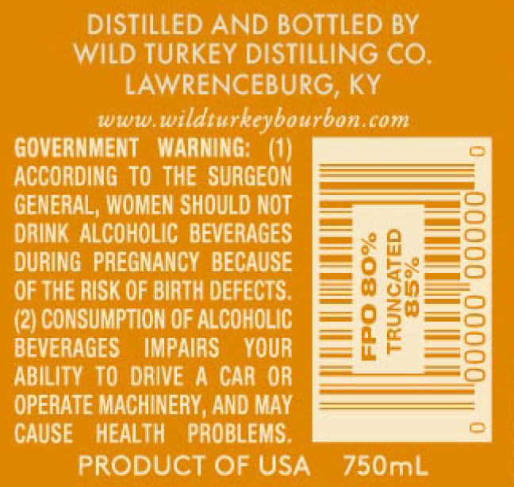
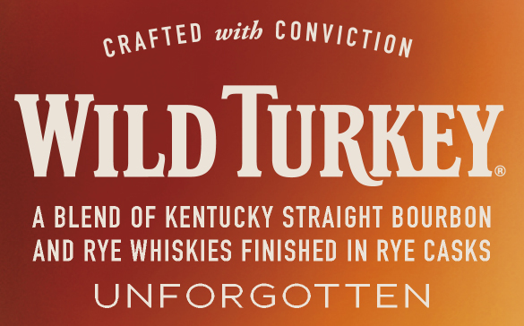

# TTB COLA Label Images - TTBID 22075001000974

**Brand Name:** WILD TURKEY

**Fanciful Name:** UNFORGOTTEN

**Issue Date:** 04/06/2022

**Origin Code:** 22

**Product Class/Type:** 129

**Source:** [TTB Public COLA Registry](https://ttbonline.gov/colasonline/viewColaDetails.do?action=publicFormDisplay&ttbid=22075001000974)

## Label Images

### Back Label

### Front Label

### Label 4

## Extracted Label Text

*Text extracted via OCR - may contain errors*

*1 image(s) excluded: text did not meet readability threshold*

### Back Label

DISTILLED AND BOTTLED BY
WILD TURKEY DISTILLING CO.
LAWRENCEBURG, KY

www.wildturkeybourbon.com
GOVERNMENT WARNING: (1) [im
ACCORDING TO THE SURGEON ————
GENERAL, WOMEN SHOULD NOT —=Seee—t=
DRINK ALCOHOLIC BEVERAGES F>=ety-te—tey
DURING PREGNANCY BECAUSE F=¥-g-ee— ted
OF THE RISK OF BIRTH DEFECTS. =i eam
(2) CONSUMPTION OF ALCOHOLIC F=f i hademetes
BEVERAGES IMPAIRS YOUR = §raae=—eb—
ABILITY TO ORVEA CARO? =)
OPERATE MACHINERY, AND MAY ees
CAUSE HEALTH PROBLEMS. — =

PRODUCT OF USA 750mL

### Front Label

GRAFTED with CONVICT gy

WILD IURKE

A BLEND OF KENTUCKY STRAIGHT BOURBO

AND RYE WHISKIES FINISHED IN RYE CASK

UNFORGOTTEN
