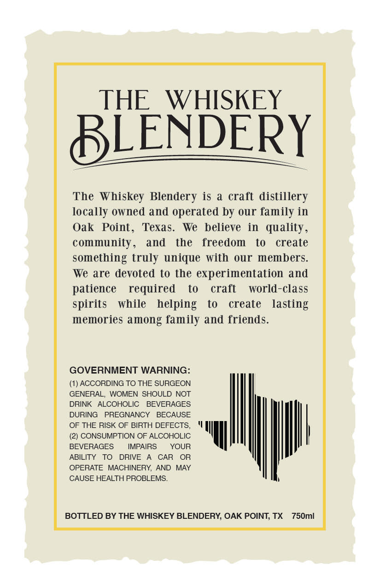
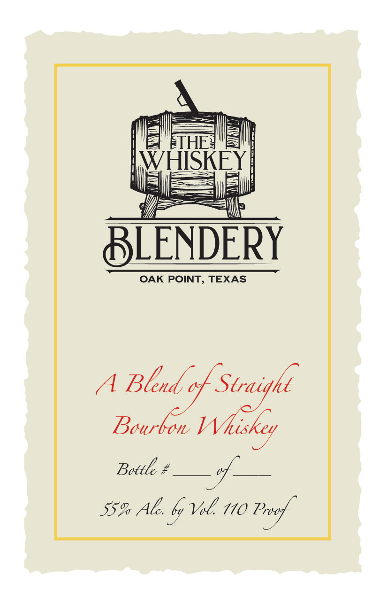

# TTB COLA Label Images - TTBID 22076001000419

**Brand Name:** THE WHISKEY BLENDERY

**Issue Date:** 03/22/2022

**Origin Code:** 44

**Product Class/Type:** 121

**Source:** [TTB Public COLA Registry](https://ttbonline.gov/colasonline/viewColaDetails.do?action=publicFormDisplay&ttbid=22076001000419)

## Label Images

### Back Label

### Front Label

## Extracted Label Text

*Text extracted via OCR - may contain errors*

### Back Label

THE
WHISKEY
BLENDERY
The Whiskey Blendery is a craft distillery
locally owned and operated by OUr family in
Oak   Point_
Texas.
We   believe   in   quality ,
community_
and
the
freedom
to
create
something truly unique with
our members.
We are devoted to the experimentation and
patience
required
to
craft
world-class
spirits
while
helping
to
create
lasting
memories among family and friends.
GOVERNMENT WARNING:
(1) ACCORDING TO THE SURGEON
GENERAL
WOMEN SHOULD NOT
DRINK   ALCOHOLIC
BEVERAGES
DURING
PREGNANCY
BECAUSE
OF THE RISK OF BIRTH DEFECTS,
(2) CONSUMPTION OF ALCOHOLIC
BEVERAGES
IMPAIRS
YOUR
ABILITY
TO
DRIVE
CAR
OR
OPERATE MACHINERY
AND
MAY
CAUSE HEALTH PROBLEMS_
BOTTLED BY THE WHISKEY BLENDERY; OAK POINT; TX
750ml

### Front Label

ETHE
WHISKEY
BLENDERY
OAK POINT, TEXAS
A Blend c| Straigke
Bourbon Whiskey
Bottle $
55% Al: ly Vol 110 Proef
