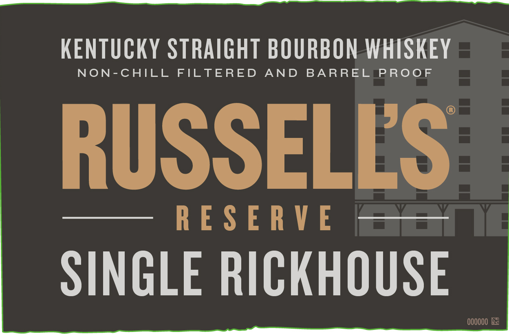
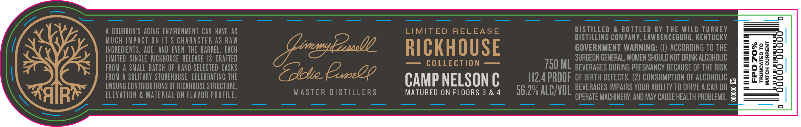
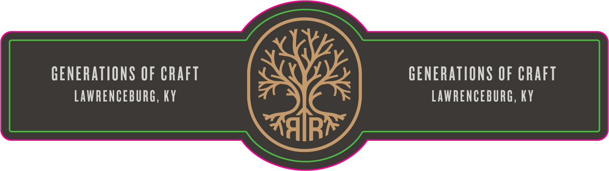

# TTB COLA Label Images - TTBID 22080001000847

**Brand Name:** RUSSELL'S RESERVE

**Fanciful Name:** RICKHOUSE

**Issue Date:** 03/25/2022

**Origin Code:** 22

**Product Class/Type:** 101

**Source:** [TTB Public COLA Registry](https://ttbonline.gov/colasonline/viewColaDetails.do?action=publicFormDisplay&ttbid=22080001000847)

## Label Images

### Label 1

### Label 2

### Label 3

## Extracted Label Text

*Text extracted via OCR - may contain errors*

*1 image(s) excluded: text did not meet readability threshold*

**Detected Proof:** 112.4

### Label 1

KeNTuCKY STRAIGHT BOURBON WHSKEY
NON-CHILL
FILTERED
AND
BA RREL
PRooF
RUSSELLS
5
R E S E RV E
SINGLE RICKHOUSE
000000 E

### Label 2

A BOURBON 'S AGING ENVIRONMENT CAN HAVE AS
LIMITED RELEASE
DISTILLED & BOTTLED BY THE WILD TURKEY
MUCH MpaCt ON IT'$ CHARACtEr as RAI
DISTILLING COMPANY, LAWRENCEBURG, KENTUCKY
INGREDIENTS, AGE , ANDEVEN THE   baRREL: Each
(Lirnydzsbell
RICKHOUSE
GOVERNMENT WARNING:
ACCORDING TO THE
8
2
@
LIMITED   SINGLE   RICKHOUSE  RELEASE  [S   CRAFTED
SURGEON GENERAL, WOMEN SHOULD NOT DRINK ALCOHOLIC
FROM
ShalLBATCh OF HaND-SELECTED  CASkS
TOtcie Enz2Q
COLLECTION
750 ML BEvERAGES DURING PREGNANCY BECAUSe OF THE RISK
8
H
FROM a SOLITARY  STOREHOUSE , CELEBRATING THE
CAMP NELSON €
1I2.4 PROOF  of BIRTH defects. (2) CONSUMPTION OF ALCOHOLIC @
3
UNSUNG CONTRIBUTIONS OF RICKHOUSE STRUCTURE,
56.2% ALC/VOL BEvERAGes IMPAIRS VOUR ABILITV TQ DRIVEA CAR OR
ELEVATION & MAterlal ON FLAVOR PROFILE:
MASTER DISTILLERS
MATURED ON FLOORS 3 & 4
OPERATE MACHINERY, AND MAY CAUSE HEALTH PROBLEMS.
1
