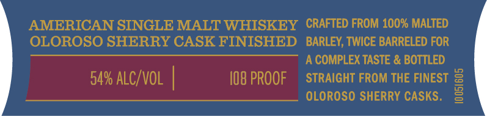
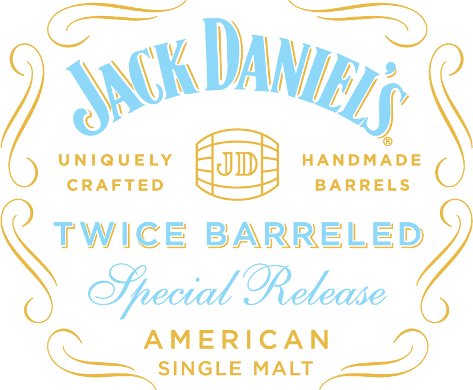
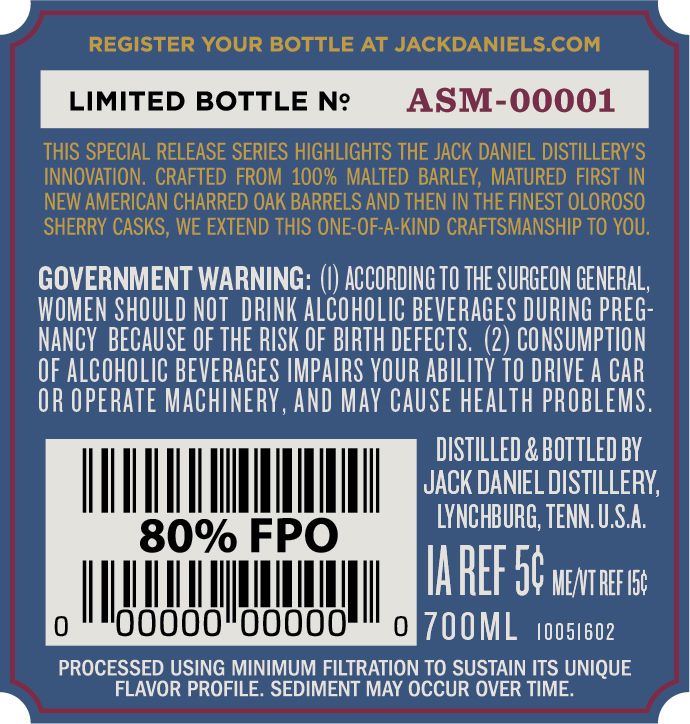
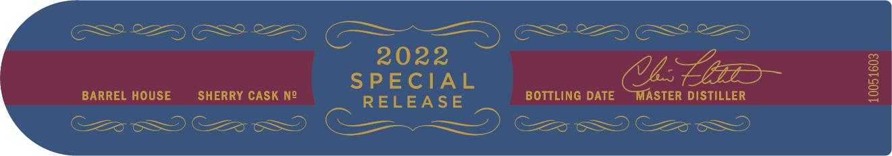

# TTB COLA Label Images - TTBID 22089001000941

**Brand Name:** JACK DANIEL'S

**Fanciful Name:** TWICE BARRELED SPECIAL RELEASE AMERICAN SINGLE MALT

**Issue Date:** 04/06/2022

**Origin Code:** 43

**Product Class/Type:** 140

**Source:** [TTB Public COLA Registry](https://ttbonline.gov/colasonline/viewColaDetails.do?action=publicFormDisplay&ttbid=22089001000941)

## Label Images

### Front Label

### Label 1

### Label 3

### Label 4

## Extracted Label Text

*Text extracted via OCR - may contain errors*

### Front Label

AMERICAN SINGLE MALT WHISKEY CRAFTED FROM 100% MALTED

OLOROSO SHERRY CASK FINISHED BARLEY, TWICE BARRELED FOR

A COMPLEX TASTE & BOTTLED

54% ALC/VOL |

108 PROOF

STRAIGHT FROM THE FINEST

OLOROSO SHERRY CASKS.

=

### Label 1

<ac Day,

UNIQUELY

youl

Mey

HANDMADE

(

CRAFTED

BARRELS

\

iy.

WICE BARRELE

Special Release

C

ee

“INGLE MALT <=

SINGLE WAL)

### Label 3

d

x

GOVERNMENT WARNING: (|) ACCORDINGTO THE SURGEON GENERAL

WOMEN SHOULD NOT DRINK ALCOHOLIC BEVERAGES DURING PREG:

NANCY BECAUSE OF THE RISK OF BIRTH DEFECTS. (2) CONSUMPTION

OF ALCOHOLIC BEVERAGES IMPAIRS YOUR ABILITY 10 DRIVE A CAR

OR OPERATE MACHINERY, AND MAY CAUSE HEALTH PROBLEMS

DISTILLED & BOTTLED BY

IL

JACK DANIEL DISTILLERY,

LYNCHBURG, TENN. U.S.A

IAREF 9¢ vce

TM ill THA

TOOML toosieoz

PROCESSED USING MINIMUM FILTRATION TO SUSTAIN ITS UNIQUE

>

FLAVOR PROFILE. SEDIMENT MAY OCCUR OVER TIME.

4

### Label 4

(GSS 2225 GS & = = Ss GS Se

2022

SPECIAL

(Ue Le

BARREL HOUSE

SHERRY CASK N2

RELEASE

BOTTLING DATE ~MASTER DISTILLER

ee

Cc

Cz

Ses OS
