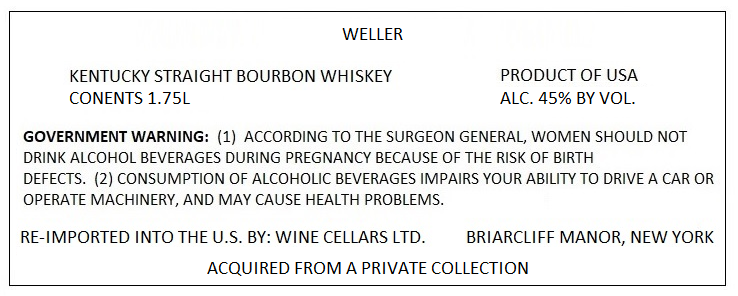
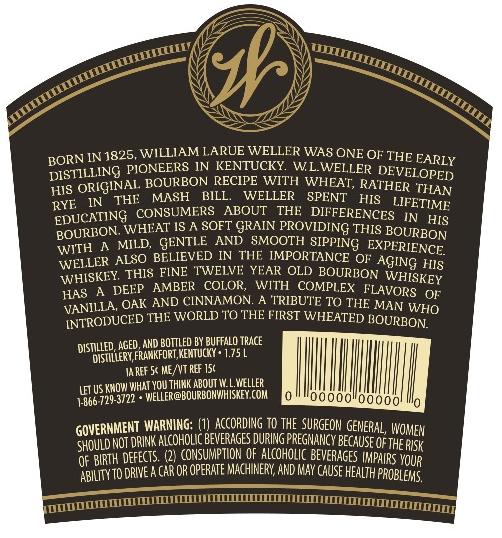
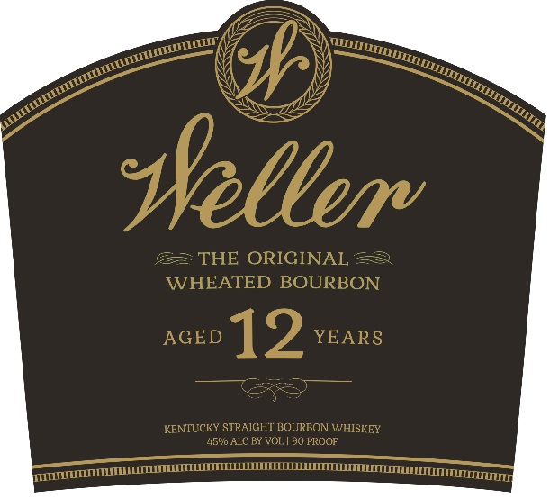

# TTB COLA Label Images - TTBID 22094001000582

**Brand Name:** WELLER

**Issue Date:** 04/12/2022

**Origin Code:** 00

**Product Class/Type:** 101

**Source:** [TTB Public COLA Registry](https://ttbonline.gov/colasonline/viewColaDetails.do?action=publicFormDisplay&ttbid=22094001000582)

## Label Images

### Label 1

### Label 2

### Label 3

## Extracted Label Text

*Text extracted via OCR - may contain errors*

**Detected Proof:** 90
**Detected Age:** 12 Years

### Label 1

WELLER
KENTUCKY STRAIGHT BOURBON WHISKEY
PRODUCT OF USA
CONENTS 1.75L
ALC. 45% BY VOL.
GOVERNMENT WARNING: (1) ACCORDING TO THE SURGEON GENERAL, WOMEN SHOULD NOT
DRINK ALCOHOL BEVERAGES DURING PREGNANCY BECAUSE OF THE RISK OF BIRTH
DEFECTS_
(2) CONSUMPTION OF ALCOHOLIC BEVERAGES IMPAIRS YOUR ABILITY TO DRIVE A CAR OR
OPERATE MACHINERY, AND MAY CAUSE HEALTH PROBLEMS
RE-IMPORTED INTO THE U.S. BY: WINE CELLARS LTD.
BRIARCLIFF MANOR, NEW YORK
ACQUIRED FROM A PRIVATE COLLECTION

### Label 2

BORN IN 1825 WILLIAMNVARUETWCLLER WASONE OF THE EARLY
DISTILLING PIONEERS IN
KENTUCKY
WLWELLER DEVELOPED
ORIGINAL; BOURBON RECIPE WITH WHEAT, RATHER THAN
THI
MASH
BILL
WELLER
SPENT
HIS
LFETIME
RYE
EDUCATING  CONSUMERS
ABOUT
THE
DIFFERENCES
WHEAT IS
SOFT GRAIN
PROVIDNG THIS BOURBON
WITH
MILD,
GENTLE
AND SMOOTH SIPPING
EXPERIENCE
WELLER ALSO BELIEVED INTTIYE AMPORTANCE Or AGING HIS
WHISKLY THIS_
TWELVR YEAR OLD BOURBON WHISKEY
HAS
DEEP AMBER
COLOR,
WITH COMPLEX FLAVORS
VANILLA, OAK
CINNAMON:
"TRIBUTE TO THE MAN WHO
INTRODUCED THE WORLD TO THE FTRST WHEATED BOURBON
AGED, AHD BOTTLED BY BUFFALO TRACe
Disthllert fraakfori KExTucY * 1.75 L
Ia ReF
ME} VT REF 1Sc
LFT US KMOw WIhat YQuThimR ABQUTVLVeller
1E66 72953722 * welleR@Bourbowwhiskey CoM
00"005
GOVERHMENT WARNING;
ACCoRdING TO The SURGEON GEMERaL,
Should NoT DRI AlcoHolc BEVERAGES DURING PREGMMNCy BECause OFtHE RISK
OF BIRTH defects . (2} CONSUMPTION €F ALcoHolc BEVERAGes Mapairs YOUR
ABHITy T0 DRIE a Car OR operate Machery AND May cause Health problems
DODDOMMMMIM
miwmooo
ITHILIIHITHIUII
HIS
BOURIJON:
FINE
AND
DISTLLED
KOMEM

### Label 3

seller
THE ORIGINAL
WHEATED BOURBON
AGED
12
YEARS
KENTUCKY STRAIGHT BOURBON WHISKEY
4590 ALC BY VOL
90 PROOF
