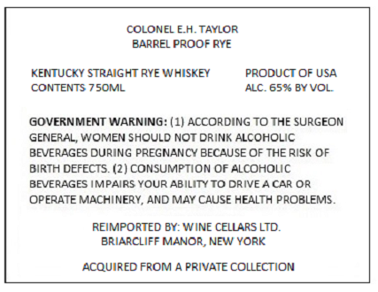
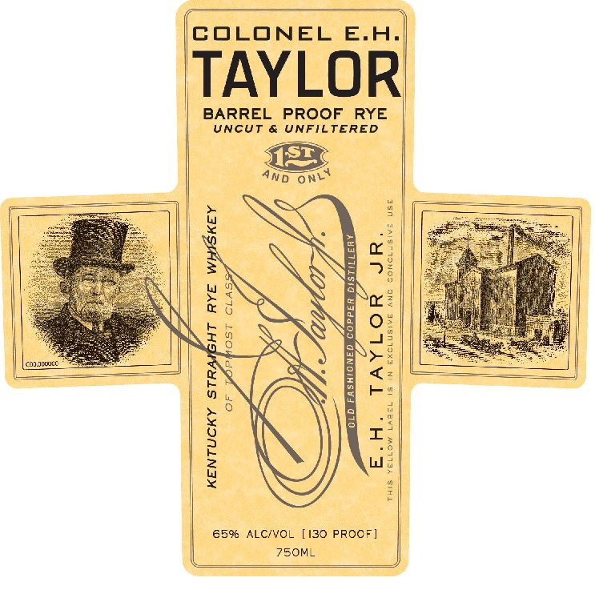
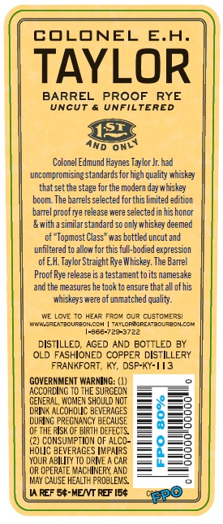
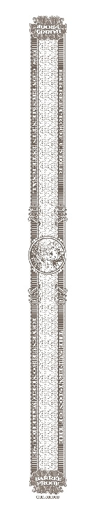

# TTB COLA Label Images - TTBID 22094001000593

**Brand Name:** COLONEL E.H. TAYLOR

**Issue Date:** 04/14/2022

**Origin Code:** 00

**Product Class/Type:** 102

**Source:** [TTB Public COLA Registry](https://ttbonline.gov/colasonline/viewColaDetails.do?action=publicFormDisplay&ttbid=22094001000593)

## Label Images

### Label 1

### Label 2

### Label 3

### Label 4

## Extracted Label Text

*Text extracted via OCR - may contain errors*

*1 image(s) excluded: text did not meet readability threshold*

### Label 1

COLONEL EA.TAYLOR
BARREL PROOF RYE
KENTUCKY STRAIGHT RYE WHISKEY
PRODUCT OF USA
CONTENTS 75OML
ALC. 6523 BYVOL
GOVERNMENT WARNING: (1) ACCORDING TO THE SURGEON
GENERAL; WOMEN SHQULD NOT DRINK ALCOHOLIC
BEVERAGES DURING PREGNANCY BECAUSE OF THE RISK OF
BIRTH DEFECTS. (2) CONSUMPTION OF ALCOHOLIC
BEVERAGES IMPAIRS YOUR ABILITYTO DRIVE A CAR OR
OPERATE MACHINERY, AND MAY CAUSE HEALTH PROBLEMS .
REIMPORTED BY: WINE CELLARS LTD.
BRIARCLIFF MANOR, NEW YORK
ACQUIRED FROM
PRIVATE COLLECTION

### Label 2

COLONEL E.A_
TAYLOR
BARREL
PROOF
RYE
UncUT
UNFILTERED
ONL
9
1
57
a
43
6 8
L
1
Oun nouCC
6
1
8
0
1
1
659
ALC/VOL
[I30 PROCF ]
75OM_
AND

### Label 3

COLONEL
E.A
TAYLOR
BARREL
PROOF
RYE
UnCUT
UnFILTERED
ND
Colonel Edmund Haynes Tzylor Jr: had
urcompromising standardsforhigh quality whiskey
that set the stage for tne modern day whiskey
boom The barrels selected forthis limited edition
barrelproof rye relezse were selected in his honcr
&with a similar standard so onlywhiskey deemed
of ~ Topmost Class" was bottled uncut and
unfiltered
allow tor 676S Tul-dodied expression
OfEH Taylor Straight Rye Whiskey. The Barrel
Proof Rye release is a testamenttoits namesake
and the Measures
took=
ensure that all of his
whiskeys were 5
unmatched quality.
AVe Lov:
HzaR TRcv Qur custcver5i
W-AdAMZOURECN C 4 | TTLCRA REAmBoUrBon,CC
1-8667725-3723
DISTILLED
AGED AND EOTTLED BY
OLD FASHIONED COPPE? DISTILLERY
FRANKFORT;
Ky, DSP-KY-13
GOVERNMENT WARNING:
ACCORDING T0 THE SURGEOY
GERERAL, WOHIEL
SHOULD NOT
DRINA ALCOF OLC BEVERAGES
8
22
duang PregNancy BECAUSE
0F THE FIsk €
Blrth DEFECTS
(2) CONSUMPTION OF AlCO-
HOLC BEVERAGES IMPAIRS
2
3
YOUR ABILITY T0 DRMVE
CR OPERATE VACHINERI AnD
May ChUsE HeaLTH FROBLEWS
REF 54-MENT RBF 150
