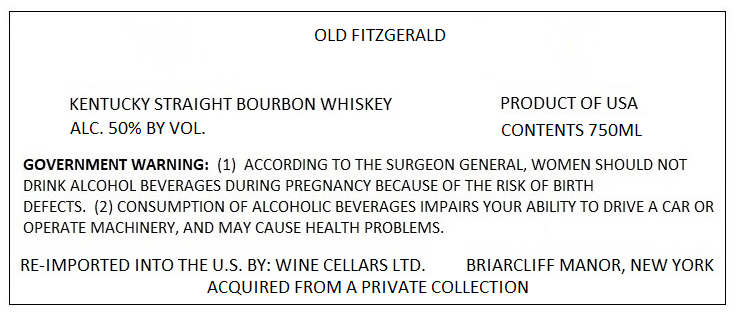
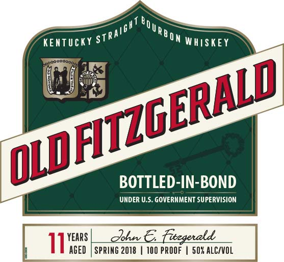
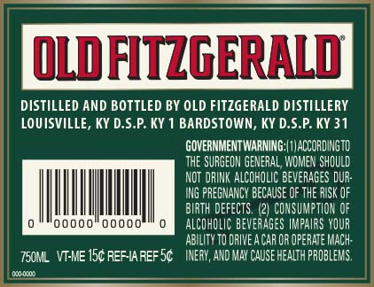

# TTB COLA Label Images - TTBID 22116001000615

**Brand Name:** OLD FITZGERALD

**Issue Date:** 06/06/2022

**Origin Code:** 22

**Product Class/Type:** 101

**Source:** [TTB Public COLA Registry](https://ttbonline.gov/colasonline/viewColaDetails.do?action=publicFormDisplay&ttbid=22116001000615)

## Label Images

### Label 1

### Label 2

### Label 3

## Extracted Label Text

*Text extracted via OCR - may contain errors*

### Label 1

OLD FITZGERALD

KENTUCKY STRAIGHT BOURBON WHISKEY

PRODUCT OF USA

ALC. 50% BY VOL.

CONTENTS 750ML

GOVERNMENT WARNING: (1) ACCORDING TO THE SURGEON GENERAL, WOMEN SHOULD NOT

DRINK ALCOHOL BEVERAGES DURING PREGNANCY BECAUSE OF THE RISK OF BIRTH

DEFECTS. (2) CONSUMPTION OF ALCOHOLIC BEVERAGES IMPAIRS YOUR ABILITY TO DRIVE A CAR OR

OPERATE MACHINERY, AND MAY CAUSE HEALTH PROBLEMS.

RE-IMPORTED INTO THE U.S. BY: WINE CELLARS LTD.

BRIARCLIFF MANOR, NEW YORK

ACQUIRED FROM A PRIVATE COLLECTION

### Label 2

KENTUCKY S

7RA

Man wiistet

as

|

a

pra

pire

BOTTLED-IN-BOND

UNDER U.S. GOVERNMENT SUPERVISION

YEARS

AGED

### Label 3

DISTILLED AND BOTTLED BY OLD FITZGERALD DISTILLERY
LOUISVILLE, KY D.S.P. KY 1 BARDSTOWN, KY D.S.P. KY 31
GOVERNMENTWARNING:| 1) ACCORDINGTO

THE SURGEON GENERAL, WOMEN SHOULD

NOT DRINK ALCOHOLIC BEVERAGES DUR-

ING PREGNANCY BECAUSE OF THE RISK OF

BIRTH DEFECTS. (2) CONSUMPTION OF

RTT ALCOHOLIC BEVERAGES IMPAIRS YOUR
ABILITY TO DRIVE A CAR OR OPERATE MACH

TS0ML VI-ME15¢ REFIAREFS¢ —INERY, AND MAY CAUSE HEALTH PROBLEMS,
