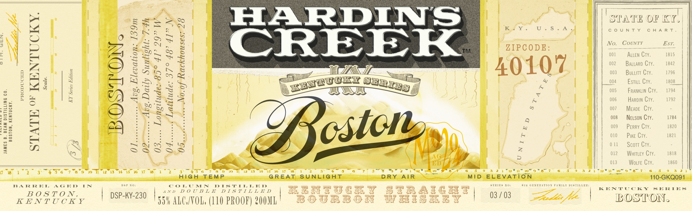
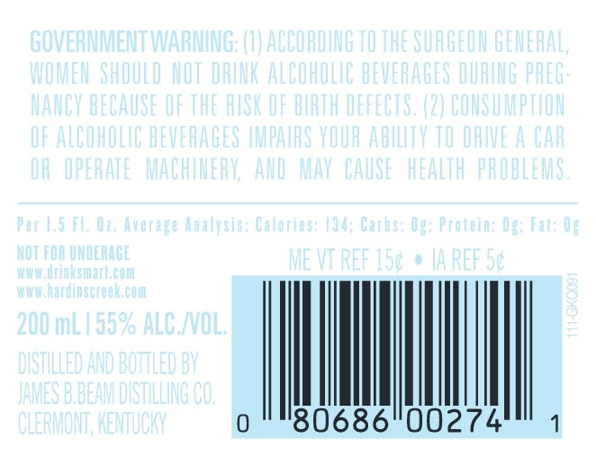
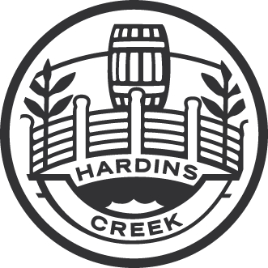

# TTB COLA Label Images - TTBID 22132001000258

**Brand Name:** HARDIN'S CREEK

**Issue Date:** 05/16/2022

**Origin Code:** 22

**Product Class/Type:** 101

**Source:** [TTB Public COLA Registry](https://ttbonline.gov/colasonline/viewColaDetails.do?action=publicFormDisplay&ttbid=22132001000258)

## Label Images

### Label 1

### Label 2

### Label 3

### Label 4

### Label 5

## Extracted Label Text

*Text extracted via OCR - may contain errors*

*4 image(s) excluded: text did not meet readability threshold*

### Label 5

DISTILLED AND BOTTLED BY

JAMESBBEAM

DISTILLING CO.
