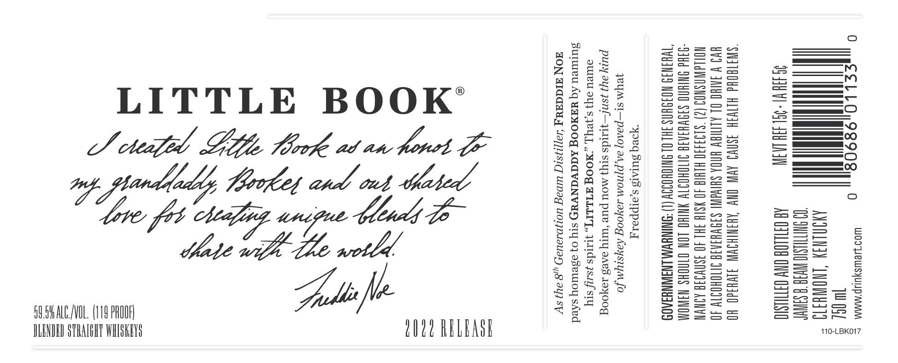
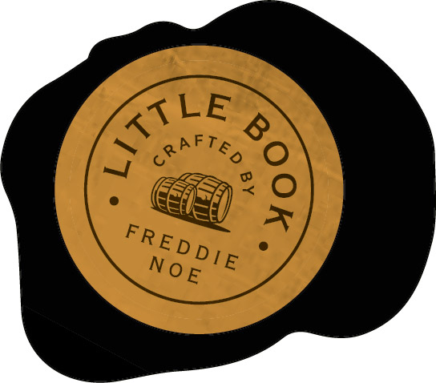

# TTB COLA Label Images - TTBID 22151001000666

**Brand Name:** LITTLE BOOK

**Issue Date:** 06/03/2022

**Origin Code:** 22

**Product Class/Type:** 129

**Source:** [TTB Public COLA Registry](https://ttbonline.gov/colasonline/viewColaDetails.do?action=publicFormDisplay&ttbid=22151001000666)

## Label Images

### Label 1

### Label 2

### Label 3

## Extracted Label Text

*Text extracted via OCR - may contain errors*

### Label 1

—.

Sao Sees

oe

eSelSe

uo=>

aon

Se

a

us

—

==

Sec

——w_

CD oa

aeSeor=

=

——

LITTLE BOOK’

Stoaea

—

Sal.

e=

|_Ne}

i

Soe

aot

ott

———s

LS chef Gop Mook at an hort GE

Seay

Soe =

|_Ne}

—a

——O

e=&

Sof +2

eno =S

Bmteaa

A

4

ail

Sea

o>

Ss =

—

Serta

copes

=a =

— i

=>

o>

aotld.

an

aS

c=

su

——

—

——— a!

——_

Ssot

4

= =

a

Seon

—

== >—- of

sae =

————

——

>)

89.54 AL./VOL. (119 PROOF)

S2a2uc

———

is

BLENDED STRALGHT WHISKEYS

fe LN22 h

PLEASE

110-LBK017

### Label 2

| a

### Label 3

=

——

ai. a

yey

PR

Poy

¢ freddie

1.

186-LBKO11
