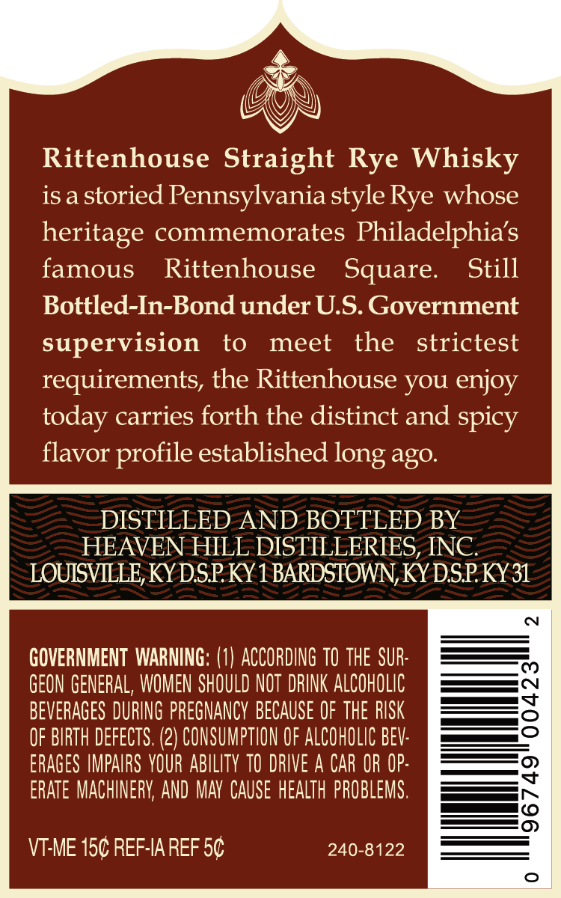
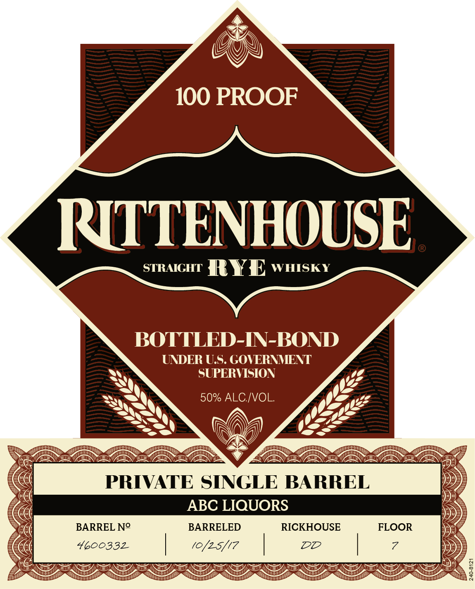

# TTB COLA Label Images - TTBID 22167001000558

**Brand Name:** RITTENHOUSE

**Fanciful Name:** PRIVATE SINGLE BARREL

**Issue Date:** 06/17/2022

**Origin Code:** 22

**Product Class/Type:** 112

**Source:** [TTB Public COLA Registry](https://ttbonline.gov/colasonline/viewColaDetails.do?action=publicFormDisplay&ttbid=22167001000558)

## Label Images

### Back Label

### Label 1

## Extracted Label Text

*Text extracted via OCR - may contain errors*

### Back Label

&

Giw\N

VY)

Rittenhouse Straight Rye Whisky

is a storied Pennsylvania style Rye whose

heritage commemorates Philadelphia's

famous

Rittenhouse Square.

Still

Bottled-In-Bond under U.S. Government

supervision to meet the strictest

requirements, the Rittenhouse you enjoy

today carries forth the distinct and spicy

flavor profile established long ago.

DISTILLED AND BOTTLED BY

HEAVEN HILE DISTILLERIES, INC.

LOUISVILLE, KY DSP. KY 1 BARDSTOWN, KY DSP. KY 31

GOVERNMENT WARNING: (1) ACCORDING T0 THE SUR-

GEON GENERAL, WOMEN SHOULD NOT DRINK ALCOHOLIC

BEVERAGES DURING PREGNANCY BECAUSE OF THE RISK

OF BIRTH DEFECTS. (2) CONSUMPTION OF ALCOHOLIC BEY

ERAGES IMPAIRS YOUR ABILITY 10 DRIVE A CAR OR OP

ERATE MACHINERY, AND MAY CAUSE HEALTH PROBLEMS

VT-ME 15¢ REF-IA REF 5¢

240-8122

### Label 1

S)

BO

100 PRO

N

INTTENHOUS

srraicur ¥R Y a wuisky

ED-IN-BOND

ATE

JNDER U.S. GOVERNMENT

SUPERVISION

50% ALC./VOL.

VA

PRIVATE SINGLE BARREL

ABC LIQUORS

BARREL N°

BARRELED

RICKHOUSE

FLOOR

4G0033L

DDO

7

.

/0, ma
