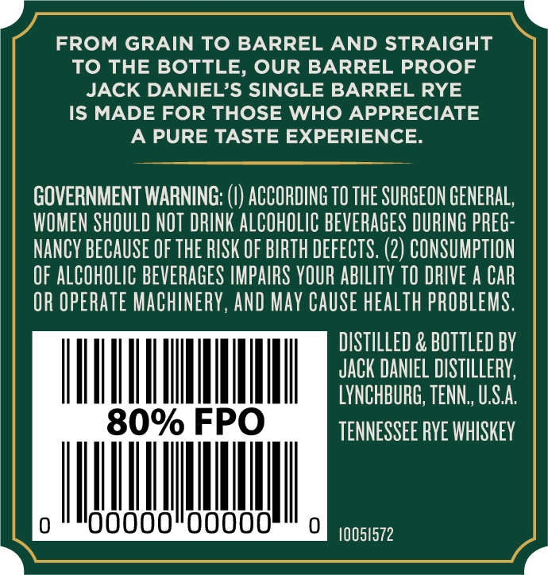
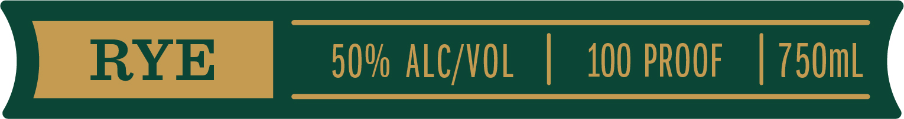
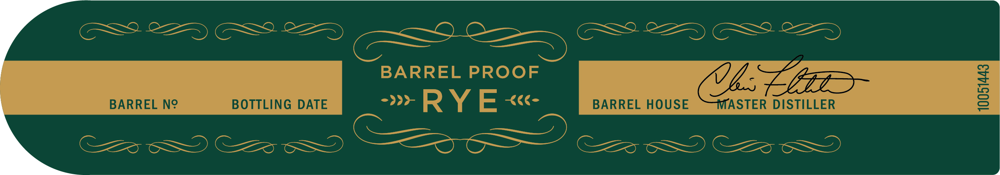

# TTB COLA Label Images - TTBID 22187001000151

**Brand Name:** JACK DANIEL'S

**Fanciful Name:** SINGLE BARREL BARREL PROOF RYE

**Issue Date:** 07/12/2022

**Origin Code:** 43

**Product Class/Type:** 142

**Source:** [TTB Public COLA Registry](https://ttbonline.gov/colasonline/viewColaDetails.do?action=publicFormDisplay&ttbid=22187001000151)

## Label Images

### Back Label

### Front Label

### Label 4

## Extracted Label Text

*Text extracted via OCR - may contain errors*

*1 image(s) excluded: text did not meet readability threshold*

### Back Label

FROM GRAIN TO BARREL AND STRAIGHT
To THE BOTTLE, OUR BARREL PROOF
JACK DANIELS SINGLE BARREL RYE
IS MADE FOR THOSE WHO APPRECIATE
A PURE TASTE EXPERIENCE:
GOVERNMENT WARNING;
ACCORDING TO THE SURGEON GENERAL,
WOMEN SHOULD NOT DRINK ALCOHOLIC BEVERAGES DURING PREG
NANCY BECAUSE €F THE RISK OF BIRTH DEfECTS: (2) CONSUMPTION
OF ALCOHOLIC BEVERAGES IMPAIRS YOUR ABILITY TO DRIVE A CAR
OR OpERATe MAChINERY, AND May CaUSe health pROBLEMS.
DISTILLED & BOTTLeD BY
JACK DANIEL DISTILLERY,
LYNCHBURG; TENN , USA
80% FPO
TENNESSEE RYE WHISKEY
00
OOO0
10051572

### Label 4

BARREL PROOF
VL EBnz
BARREL N?
BOTTLING
DATE
> RYE <-
BARREL HOUSE
MASTER DISTILLER
1
22
32
2
