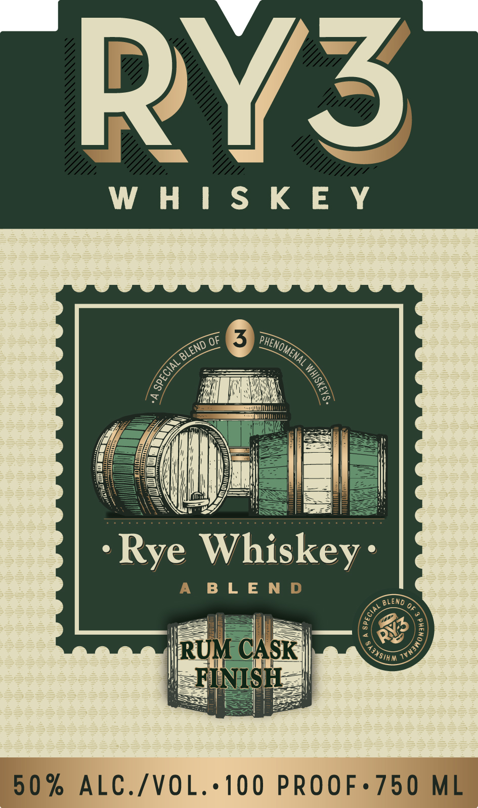
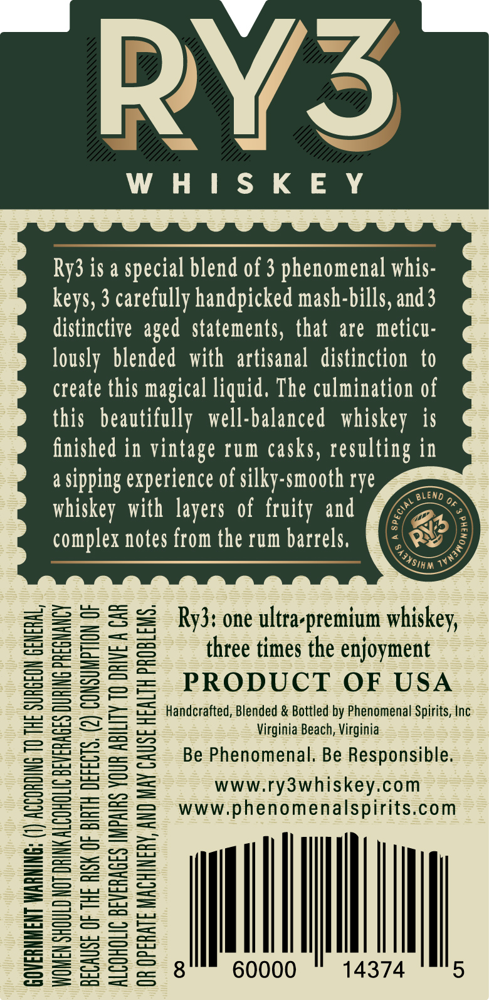

# TTB COLA Label Images - TTBID 22215001000413

**Brand Name:** RY3 WHISKEY

**Issue Date:** 08/05/2022

**Origin Code:** 05

**Product Class/Type:** 132

**Source:** [TTB Public COLA Registry](https://ttbonline.gov/colasonline/viewColaDetails.do?action=publicFormDisplay&ttbid=22215001000413)

## Label Images

### Label 1

### Label 2

## Extracted Label Text

*Text extracted via OCR - may contain errors*

### Label 1

wv

WHISKEY

sot

ENG) Ms

6P/

4,

at

2

ity

-Rye Whiskey:

BLEN

Ba

ig

C

FI

i

C./VOL

100 PROOF

### Label 2

wy,

/

WHISKEY

Ry3 is a special blend of 3 phenomenal whis

keys, 3 carefully handpicked mash-bills, and3

distinctive aged statements, that are meticu

lously blended with artisanal distinction to

create this magical liquid, The culmination of

this beautifully well-balanced whiskey is

finished in vintage rum casks, resulting in

a sipping experience of silky-smooth rye

whiskey with layers of fruity and

Z

complex notes from the rum barrels,

Srrreny

Sos

sS

=

——

= = Ry3: one ultra-premium whiskey,

=

===

—re——)

=——T—)

three times the enjoyment

So

Seat oa

Seses

PRODUCT OF USA

ay

—

SS oo a

ms « —

se SS SSS

o Handcrafted, Blended & Bottled by Phenomenal Spirits, Inc

Sewn SS

Virginia Beach, Virginia

Sw

os SO ae =

Be Phenomenal. Be Responsible

——

ay Se

===)

SS2=2

www.ry3whiskey.com

=SS==

www.phenomenalspirits.com

———

==

SS -es5

S252

=S25=

=

Gea es eS

a

a

SyHSss

ML

SsSHese

I

60000

14374

Ss
