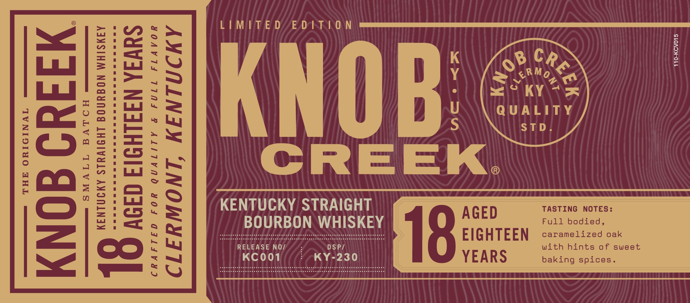
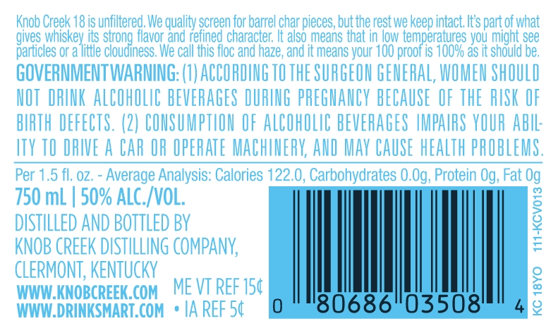
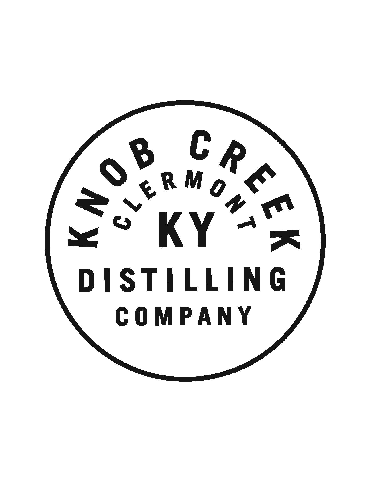
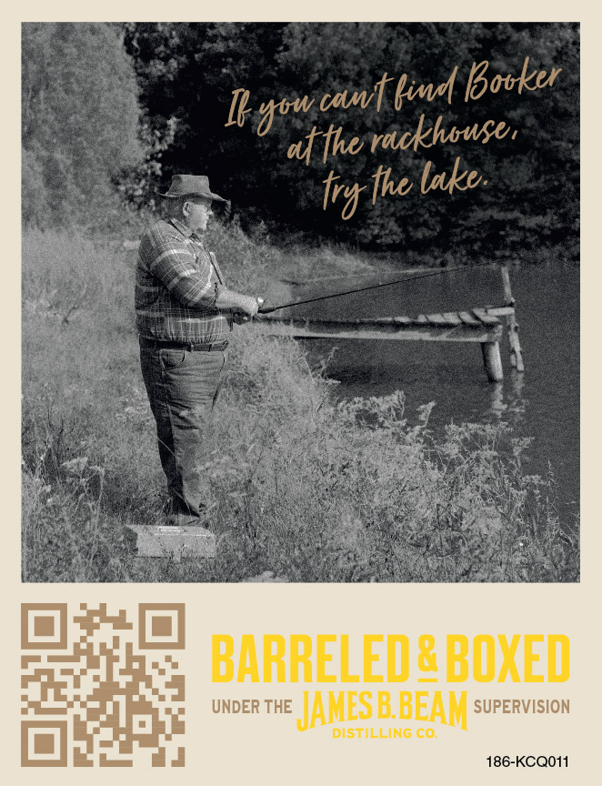

# TTB COLA Label Images - TTBID 22227001000175

**Brand Name:** KNOB CREEK

**Issue Date:** 08/17/2022

**Origin Code:** 22

**Product Class/Type:** 101

**Source:** [TTB Public COLA Registry](https://ttbonline.gov/colasonline/viewColaDetails.do?action=publicFormDisplay&ttbid=22227001000175)

## Label Images

### Label 1

### Label 2

### Label 3

### Label 4

### Label 5

## Extracted Label Text

*Text extracted via OCR - may contain errors*

*2 image(s) excluded: text did not meet readability threshold*

**Detected Proof:** 100

### Label 1

LIMITE D
E D |T |0 N
Ie
Y
1
8
1
1
Eknob
JEe
1
1
1
4
5
STD
[
1
CREEK
F
1
0
8
Ile
:
1
KENOURBOSTRHGKEY
AGED
F4sTIbodieds:
18
EIGHTEEN
caramelized oak
1
RELEASE NO/
DSP/
With hints 0f
sweet
2
KC001
KY-230
YEARS
baking spices _
CREE
0 B
c~ERMo

### Label 3

Knob Creek 18 is unfiltered We quality screen for barrel char pieces; but the rest we keep intact It's part of what
gives Whiskey its
flavor and refined character;
also means that in low temperatures you might see
particles or a little
Sgugneavofieraalefinedcharnacfeze; ana
means your 100 proof is 1O0% as it should be,
GOVERNMENTWARNING: (7) ACCORDING TO THE SURGEON GENERAL; WOMEN ShOULD
HOT  DRINK ALCOHOLIC BEVERAGES DURING pREGHANCY BECAUSE OF THE RISK OF
BIRTH DEFEcts. (2) CONSUMPTHON OF ALCOhOLIC BEVERAGES HMPAHRS YOUR AbIL:
ITV TO DRIVE A CAR OR OPERATE MACHINERY; AND Mav CAUSE HEALTH PROBLEMS.
Per 1.5 fl, 0Z.
Average Analysis: Calories 122.0, Carbohydrates 0.Og, Protein Og, Fat Og
750 mL
50% ALC_IVOL;
DISTILLED AND BOTTLED BV
1
KNOB CREEK DISTILLING COMPANy;
CLERMONT, KENTUCKY
WWW KNOBCREEK.COM
ME VT REF 154
2
WWW_DRINKSMART. COM
IA REF 54
'80686"03508'
2

### Label 5

cawtL
'Booker
Dgoadt fhorackhouses
trg fhe lake
BARRELEdRboxed
UNDER THE
JAMESB BEAM=
SUPERVISION
DISTILLINC €o
186-KCQO11
kim
