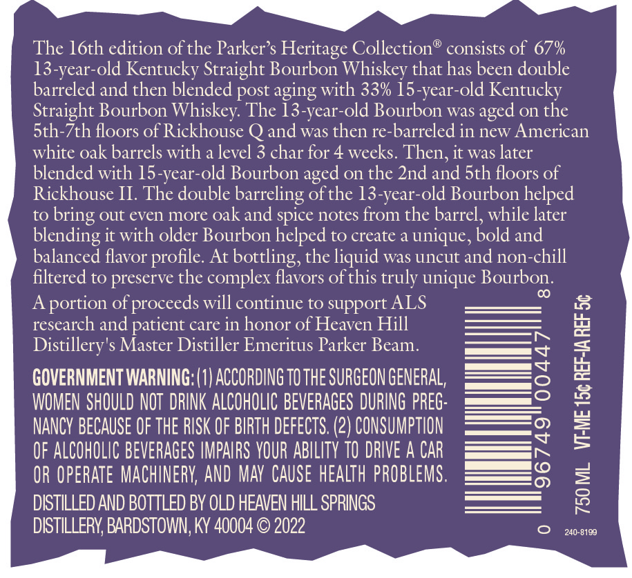
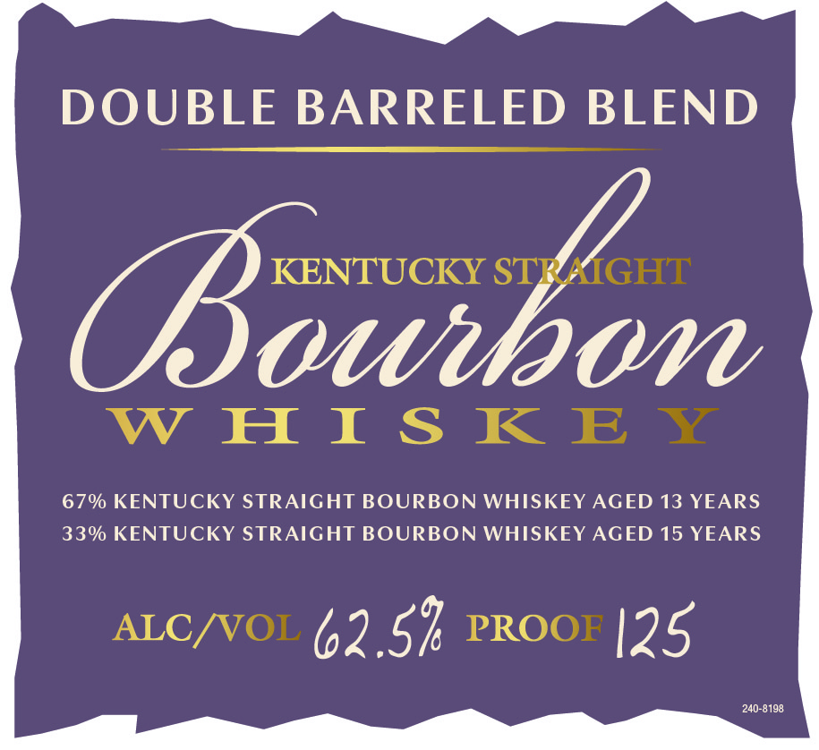
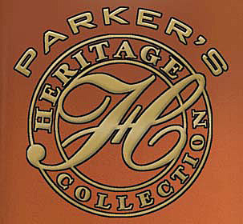

# TTB COLA Label Images - TTBID 22241001000540

**Brand Name:** PARKER'S HERITAGE COLLECTION

**Fanciful Name:** DOUBLE BARREL BLEND

**Issue Date:** 08/30/2022

**Origin Code:** 22

**Product Class/Type:** 101

**Source:** [TTB Public COLA Registry](https://ttbonline.gov/colasonline/viewColaDetails.do?action=publicFormDisplay&ttbid=22241001000540)

## Label Images

### Back Label

### Front Label

### Label 3

## Extracted Label Text

*Text extracted via OCR - may contain errors*

*1 image(s) excluded: text did not meet readability threshold*

**Detected Proof:** 125.1
**Detected Age:** 13 Years

### Back Label

The Ioth edition of the Parker $ Heritage Collection"
consists of 67%
13-year-old Kentucky Straight Bourbon Whiskey that has been double
barreled and then blended post aging with 33% 15-year-old Kentucky
Straight Bourbon Whiskey: The 13-year-old Bourbon was
on the
Sth-7th floors of Rickhouse
and was then re-barreled in new American
white oak barrels with a level 3 char for 4 weeks. Then, it was later
blended with 15-year-old Bourbon
on the 2nd and Sth floors of
Rickhouse II. The double
barreling ofthe 13-year-old Bourbon helped
to
bring out even more oak and spice notes from the barrel, while later
blending it with older Bourbon helped to create a unique, bold and
balanced flavor profile. At bottling, the liquid was uncut and non-chill
filtered to preserve the complex flavors ofthis truly unique Bourbon
CO
A
portion of proceeds will continue to support ALS
research and patient care in honor of Heaven Hill
Distillery's Master Distiller Emeritus Parker
1
GOVERNMENT WARNING: (1} ACCORDING TO THE SURGEON GENERAL,
9
WOMEN SHOULD NOT  DRINK ALCOHOLIC BEVERAGES DURING PREG:
2
NANCV BECAUSE OF ThE RISK OF BIRTH defects. (2) CONSUMPTION
4
OF ALCOHOLIC BEVERAGES IMPAIRS VOUR ABILITY TO DRIVE A CAR
8
OR OperAte MACHINERV; AND MAV  CAuSe health PROBLEMS .
DISTILLED AND BOTTLED BY OLD HEAVEN HILL SPRINGS
3
DISTILLERY; BARDSTOWN; KY 40004
2022
240-8199
aged
aged
Beam.

### Front Label

DOUBLE BARRELED BLEND
(owibon
W HI $ K EY
67% KENTUCKY STRAIGHT BOURBON WHISKEY AGED 13 YEARS
330 KENTUCKY STRAIGHT BOURBON WHISKEY AGED 15 YEARS
ALC/VOL
62.57 PROoF |25
240-8198
