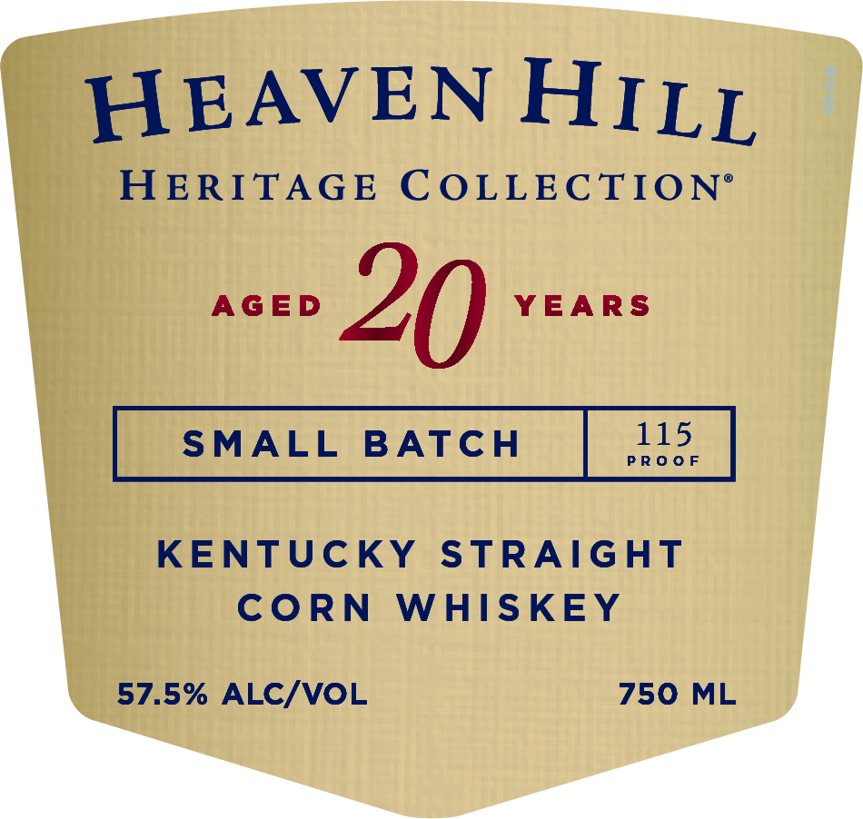
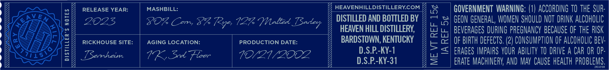
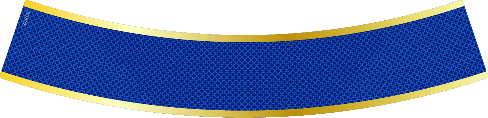
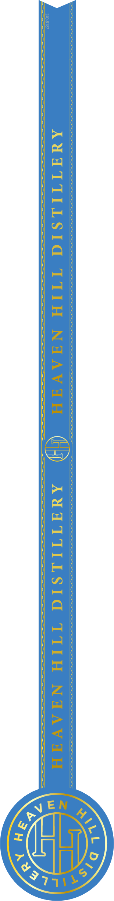

# TTB COLA Label Images - TTBID 22243001001005

**Brand Name:** HEAVEN HILL

**Issue Date:** 09/07/2022

**Origin Code:** 22

**Product Class/Type:** 103

**Source:** [TTB Public COLA Registry](https://ttbonline.gov/colasonline/viewColaDetails.do?action=publicFormDisplay&ttbid=22243001001005)

## Label Images

### Label 1

### Label 2

### Label 3

### Label 4

## Extracted Label Text

*Text extracted via OCR - may contain errors*

### Label 1

HEAVEN HILL,

HERITAGE COLLECTION’®

Bee 20 fetes

KENTUCKY STRAIGHT

CORN WHISKEY

57.5% ALC/VOL

750 ML

### Label 2

Y

RELEASE YEAR:

MASHBILL:

Y HEAVENHILLDISTILLERY.COM

oa

GOVERNMENT WARNING: (1) ACCORDING T0 THE SUR

SID

DISTILLED AND BOTTLED BY

“+ 1 GEON GENERAL, WOMEN SHOULD NOT DRINK ALCOHOLIC

I

GF

A

A|

‘Zz

BX?

ZOZS

VOR Com, P% Rye, 12 Melted Barter

HEAVEN HILL DISTILLERY,

ZI

>A

FF |

FA,

EGA |h

ZZ

rap BEVERAGES DURING PREGNANCY BECAUSE OF THE RISK

v_

A

As

|Wq)

Ko

Ag

RICKHOUSE SITE:

AGING LOCATION:

PRODUCTION DATE:

BARDSTOWN, KENTUCKY

=

cc| OF BIRTH DEFECTS. (2) CONSUMPTION OF ALCOHOLIC BEV-

y

25

11s

TSemhein.

VK, Sed Fleer

UL AY ODE

D.S.P.-KY-1

<<) ERAGES IMPAIRS YOUR ABILITY TO DRIVE A CAR OR OP

GZ

D.S.P.-KY-31

=

ERATE MACHINERY, AND MAY CAUSE HEALTH PROBLEMS

aoatat

### Label 4

f

es

NEN

277\%
