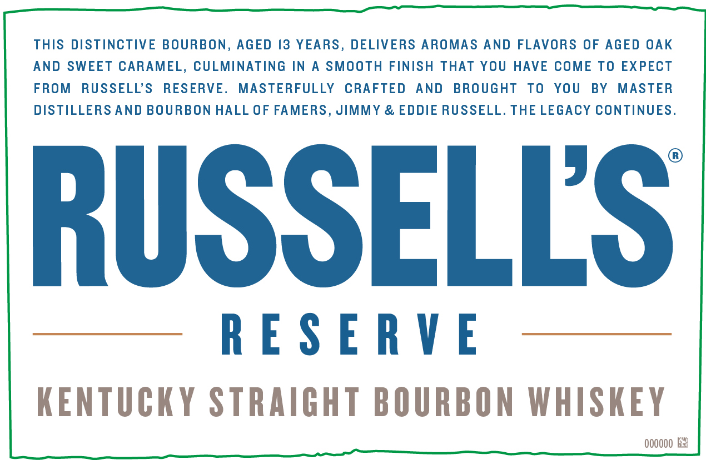
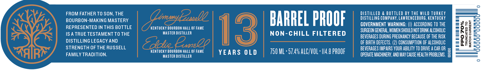
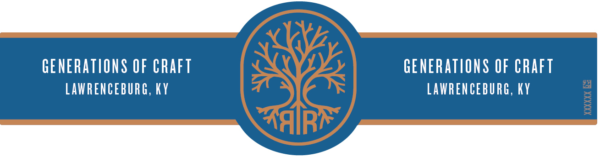

# TTB COLA Label Images - TTBID 22263001000357

**Brand Name:** RUSSELL'S RESERVE

**Fanciful Name:** 13 YEARS OLD

**Issue Date:** 09/23/2022

**Origin Code:** 22

**Product Class/Type:** 101

**Source:** [TTB Public COLA Registry](https://ttbonline.gov/colasonline/viewColaDetails.do?action=publicFormDisplay&ttbid=22263001000357)

## Label Images

### Label 1

### Label 2

### Label 3

## Extracted Label Text

*Text extracted via OCR - may contain errors*

*1 image(s) excluded: text did not meet readability threshold*

**Detected Proof:** 114.8
**Detected Age:** 3 Years

### Label 1

THIS DISTINCTIVE BOURBON, AGED /3 YEARS, DELIVERS AROMAS AND FLAVORS OF AGED OAK
AND SWEET CARAMEL, CULMINATING IN
SMOOTH FINISH THAT YOU
HAVE COME TO EXPECT
FROM
RUSSELL'S
RESERVE.
MASTERFULLY
CRAFTED
AND
BROUGHT
To
YOU
BY
MASTER
DISTILLERS AND BOURBON HALL OF FAMERS, JIMMY & EDDIE RUSSELL. THE LEGACY CONTINUES
RUSSELLS
R E S E RV E
KENTUCKy STRAIGHT BOURBON WHISKEY
00000O

### Label 2

FROM FATHER TO SON; THE
DISTILLED
& BOTTLED BY THE WILD TURKEY
BOURBON-MAKING MASTERY
(LirmydEebel
BARREL PROOF
DISTILLING COMPAnY, LAW RENCEBURG, keNTucky
REPRESENTED IN THIS BOTTLE
KENTUCKY BOURBON HALL OF FAME
13
GOVERNMENT WARNING:
ACCORDING TO THE
8
2
3
IS A TRUE TESTAMENT TO THE
MASTER DISTILLER
NON-CHILL FILTERED
SURGEON GENERAL, WOMEN SHOULD NOT DRINK ALCOHOLIC
1
BEVERAGES DURING PREGNANCY BECAUSE OF THE RISK
1
DISTILLING LEGACY AND
SOidte @x
OF BIRTH DEFECTS. (2) CONSUMPTION OF ALCOHOLIC
8
3
STRENGTH OF THE RUSSELL
BEVERAGES MPAIRS YOUR ABILITY TO DRIVE A CAR OR
KENTUCKY BOURBON HALL OF FAME
YEARS 0L D
750 ML ' 57.4% ALC/VOL ' |L4.8 PROOF
2
FAMILY TRADITION.
MASTER DISTILLER
OpeRATe MACHINERY; AND May CAuse HEALTh PROBLEMS.
