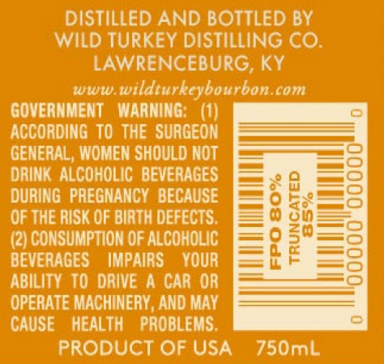
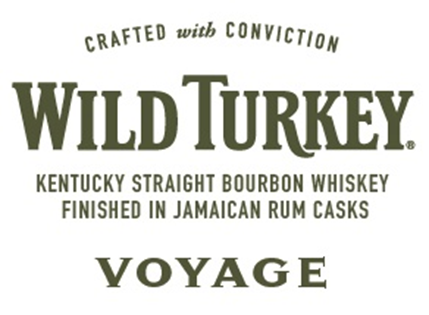
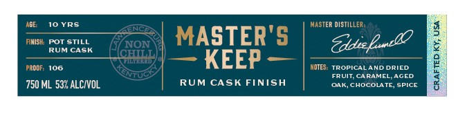
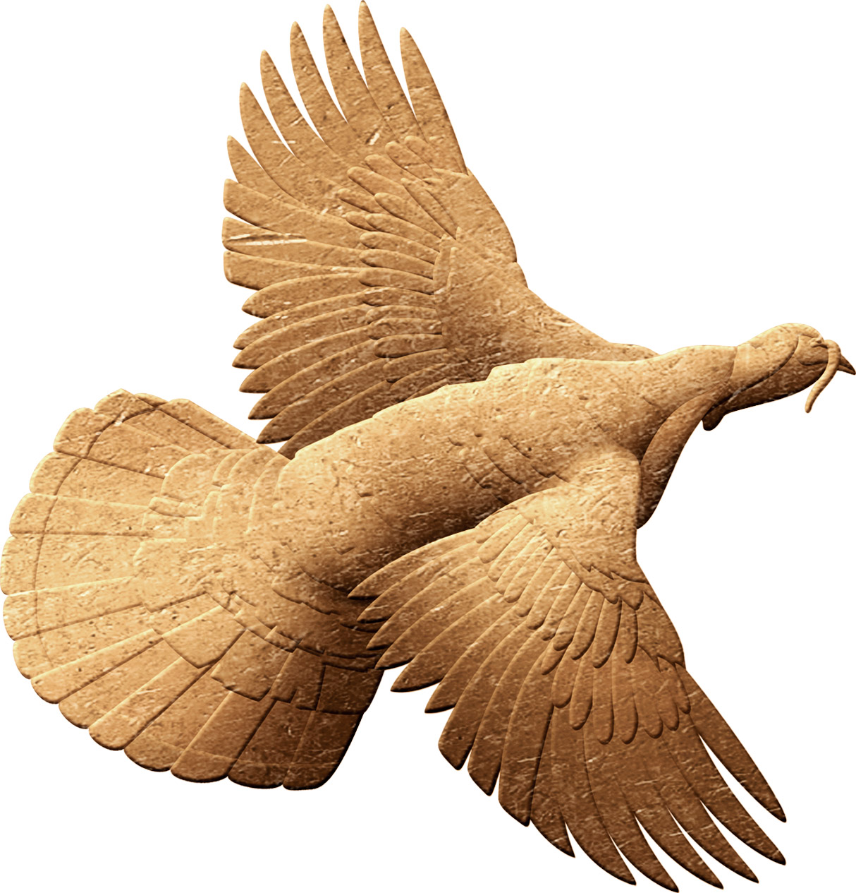

# TTB COLA Label Images - TTBID 22283001000281

**Brand Name:** WILD TURKEY

**Fanciful Name:** VOYAGE

**Issue Date:** 10/14/2022

**Origin Code:** 22

**Product Class/Type:** 641

**Source:** [TTB Public COLA Registry](https://ttbonline.gov/colasonline/viewColaDetails.do?action=publicFormDisplay&ttbid=22283001000281)

## Label Images

### Back Label

### Label 1

### Label 2

### Label 4

## Extracted Label Text

*Text extracted via OCR - may contain errors*

*1 image(s) excluded: text did not meet readability threshold*

### Back Label

DISTILLED AND BOTTLED BY

WILD TURKEY DISTILLING CO.
LAWRENCEBURG, KY

www.wildturkeybourbon.com
GOVERNMENT WARNING: (1)
ACCORDING TO THE SURGEON
GENERAL, WOMEN SHOULD NOT
DRINK ALCOHOLIC BEVERAGES
DURING PREGNANCY BECAUSE
OF THE RISK OF BIRTH DEFECTS.
(2) CONSUMPTION OF ALCOHOLIC
BEVERAGES IMPAIRS YOUR
ABILITY TO DRIVE A CAR OR
OPERATE MACHINERY, AND MAY
CAUSE HEALTH PROBLEMS.
PRODUCT OF USA 750mL

0

FPO 80%
TRUNCATED

### Label 1

CRAFTED with CONVICTION

WILD TURKEY.

KENTUCKY STRAIGHT BOURBON WHISKEY

FINISHED IN JAMAICAN RUM CASKS

VOYAGE

### Label 2

10 YRS.

ih POT STILL
RUM CASK

100

750 ML 53% ALCIVOL

RUM CASK FINISH

ER DISTILL

OES. TROPICALAND DRIED.

CRAFTED KY, USA
