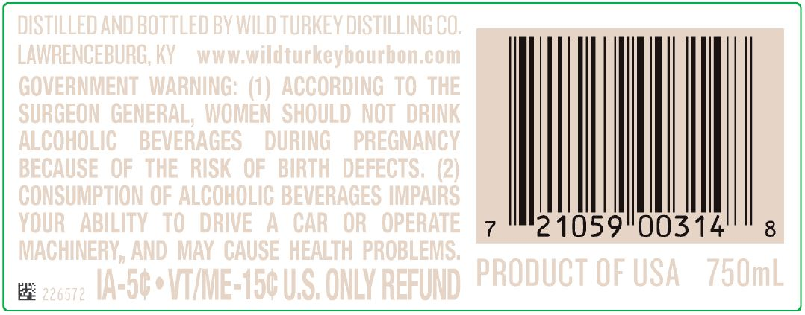
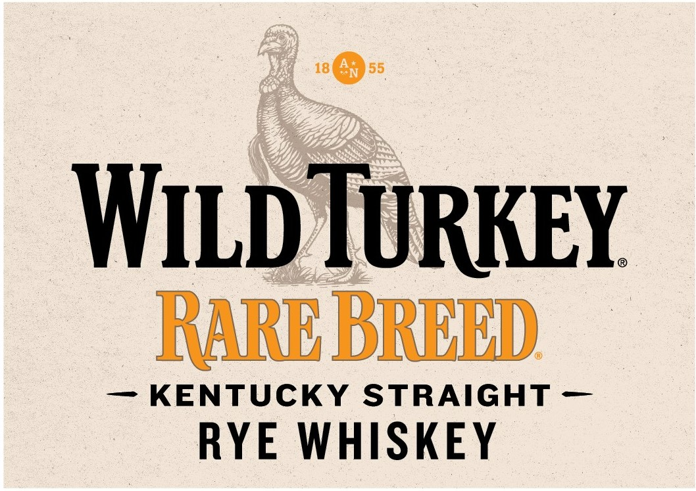
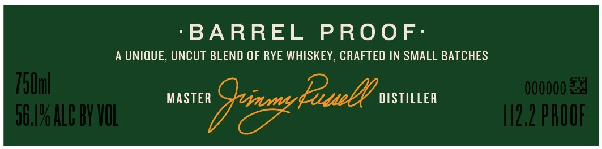
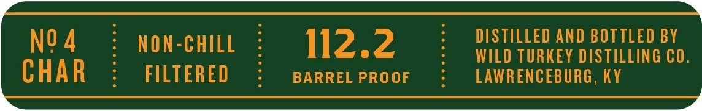

# TTB COLA Label Images - TTBID 22285001000213

**Brand Name:** WILD TURKEY

**Fanciful Name:** RARE BREED KENTUCKY STRAIGHT RYE WHISKEY

**Issue Date:** 10/20/2022

**Origin Code:** 22

**Product Class/Type:** 102

**Source:** [TTB Public COLA Registry](https://ttbonline.gov/colasonline/viewColaDetails.do?action=publicFormDisplay&ttbid=22285001000213)

## Label Images

### Back Label

### Front Label

### Label 2

### Label 3

## Extracted Label Text

*Text extracted via OCR - may contain errors*

### Back Label

Il

2105900314

### Front Label

®@

WILD TURKEY

KENTUCKY STRAIGHT

RYE WHISKEY

### Label 2

‘BARREL PROOF:

A UNIQUE, UNCUT BLEND OF RYE WHISKEY, CRAFTED IN SMALL BATCHES

### Label 3

DISTILLED AND BOTTLED BY

NO4

NON-CHILL

112.2

WILD TURKEY DISTILLING CO.

CHAR

FILTERED

BARREL PROOF

LAWRENCEBURG, KY
