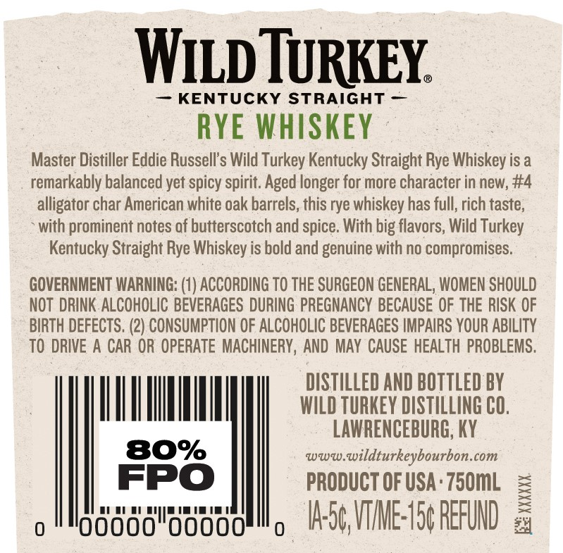
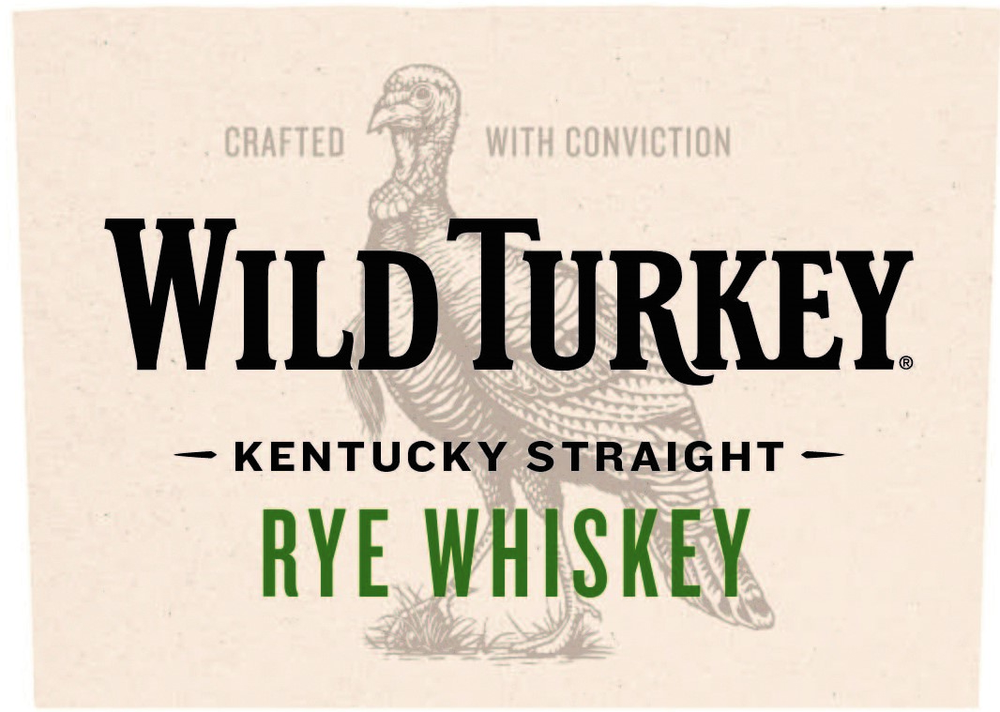
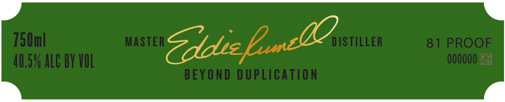
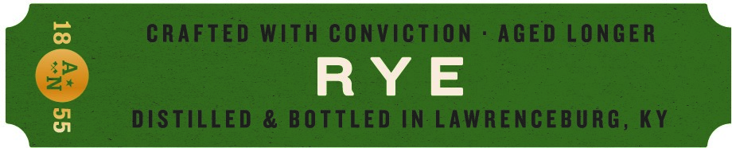

# TTB COLA Label Images - TTBID 22286001000624

**Brand Name:** WILD TURKEY

**Fanciful Name:** 81 RYE WHISKEY

**Issue Date:** 10/17/2022

**Origin Code:** 22

**Product Class/Type:** 102

**Source:** [TTB Public COLA Registry](https://ttbonline.gov/colasonline/viewColaDetails.do?action=publicFormDisplay&ttbid=22286001000624)

## Label Images

### Back Label

### Front Label

### Label 2

### Label 4

## Extracted Label Text

*Text extracted via OCR - may contain errors*

**Detected Proof:** 80

### Back Label

WLDTURKEY
KENTUCKY STRAIGHT
RYE WHISKEY
Master Distiller Eddie Russells Wild Turkey Kentucky Straight Rye Whiskey is a
remarkably balanced yet spicy spirit. Aged longer for more character in new, #4
alligator char American white oak barrels, this rye whiskey has full, rich taste;
with prominent notes of butterscotch and spice With big flavors, Wild Turkey
Kentucky Straight Rye Whiskey is bold and genuine with no compromises.
GOVERNMENT WARNING: (1) ACCORDING TO THE SURGEON GENERAL, WOMEN SHOULD
NOT  DRINK ALCOHOLIC BEVERAGES DURING PREGNANCY BECAUSE OF THE RISK OF
BIRTH DEFECTS. (2) CONSUMPTION OF ALCOHOLIC BEVERAGES IMPAIRS YOUR ABILITY
TO DRIVE A CAR OR OPERATE MACHINERY, AND MAY CAUSE HEALTH PROBLEMS.
DISTILLED AND BOTTLED BY
WILD TuRKEY DISTILLING CO,
LAWRENCEBURG; KY
80%
Www
wildturkeybourbon com
FPO
PRODUCT OF USA ' 750mL
000
IA56,VME:15 REFUND

### Front Label

CRAFTEd
WITh ConvICTION
Wild TURKEY
KENTUCKY STRAIGHT
RYE whiSKEY

### Label 2

750m|
MASTER
Zddict
DISTILLER
81 PROOF
40,59 ALC BY VOL
000OOO
BEYOND DUPLICATION
Enco

### Label 4

CRAFTED With Conviction
AGED LONGER
RY E
81
DISTILLED
& BOTTLED N LAWRENCEBURG,
KY
