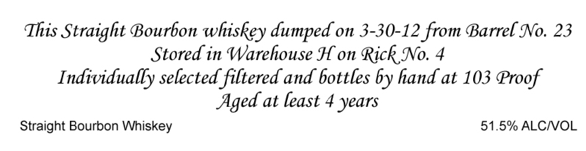
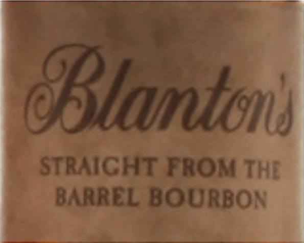
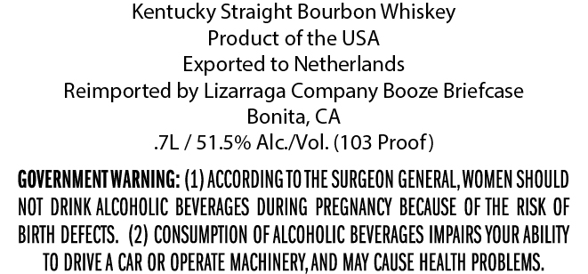

# TTB COLA Label Images - TTBID 22313001000951

**Brand Name:** BLANTON'S

**Fanciful Name:** STRAIGHT FROM THE BARREL BOURBON

**Issue Date:** 11/10/2022

**Origin Code:** 01

**Product Class/Type:** 101

**Source:** [TTB Public COLA Registry](https://ttbonline.gov/colasonline/viewColaDetails.do?action=publicFormDisplay&ttbid=22313001000951)

## Label Images

### Front Label

### Label 1

### Label 3

## Extracted Label Text

*Text extracted via OCR - may contain errors*

*1 image(s) excluded: text did not meet readability threshold*

**Detected Proof:** 103
**Detected Age:** 4 Years

### Front Label

This Straight Bourbon whiskey dumped on 3-30-12 from Barrel No. 23
Stored in Warehouse H on Rick No. 4
Individually selected filtered and bottles by hand at 103 Proof
Aged at least 4 years
Straight Bourbon Whiskey
51.5% ALCIVOL

### Label 1

OBtantons
STRAICHT FROM THE
BARREL BOURBON
