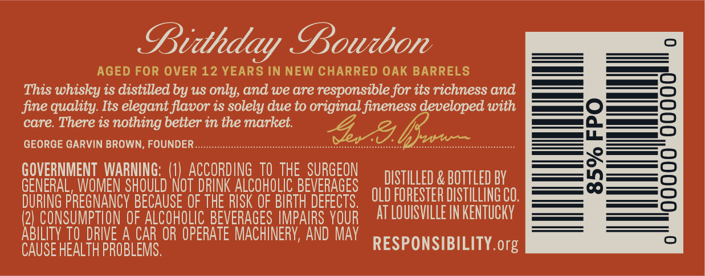
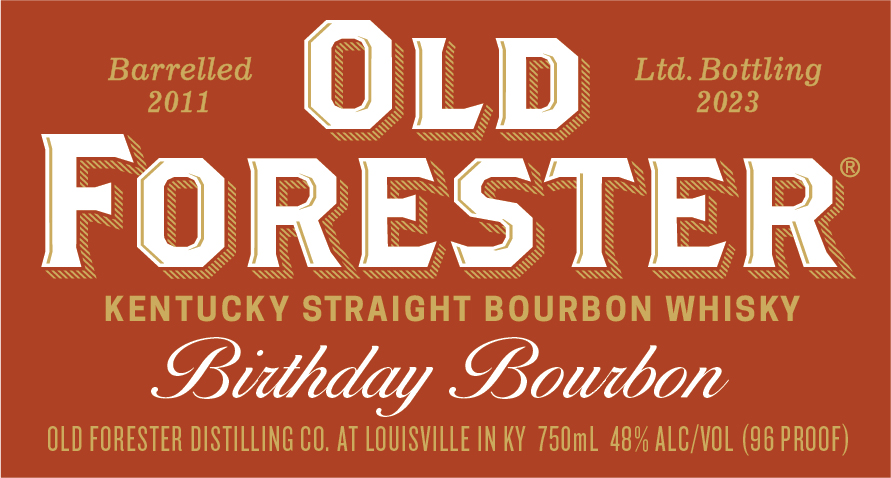
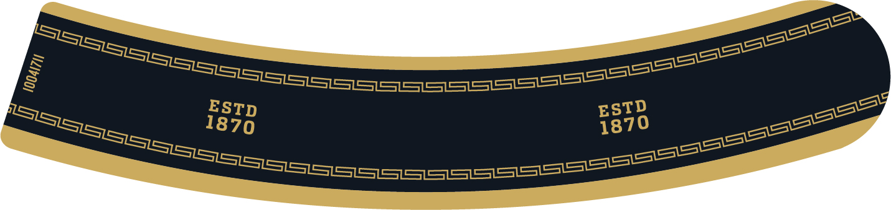
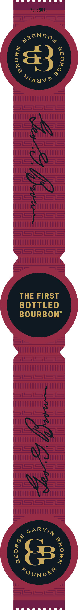
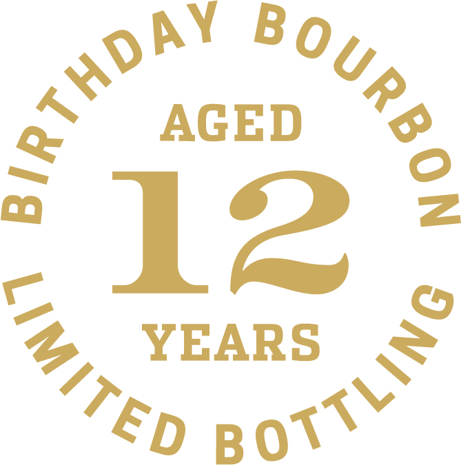

# TTB COLA Label Images - TTBID 22321001000309

**Brand Name:** OLD FORESTER

**Fanciful Name:** BIRTHDAY BOURBON 2023

**Issue Date:** 11/21/2022

**Origin Code:** 22

**Product Class/Type:** 101

**Source:** [TTB Public COLA Registry](https://ttbonline.gov/colasonline/viewColaDetails.do?action=publicFormDisplay&ttbid=22321001000309)

## Label Images

### Back Label

### Front Label

### Label 3

### Label 4

### Label 5

## Extracted Label Text

*Text extracted via OCR - may contain errors*

*3 image(s) excluded: text did not meet readability threshold*

### Back Label

LDidhiday Loubor

AGED FOR OVER 12 YEARS IN NEW CHARRED OAK BARRELS
This whisky is distilled by us only, and we are responsible for its richness and
fine quality. Its elegant flavor is solely due to original fineness developed with
care. There is nothing better in the market.
GEORGE GARVIN BROWN, FOUNDER..............c:scsessssesseesssessseesseessnessetooessnetenee Sheet iaed * (let Cag TOI rerrreeee

GOVERNMENT WARNING: \) ACCORDING 70 THE SURGEON — peri ten a anTTiEp AY
GENERAL WOMEN SHOULD NOT DRINK ALCOHOLIC BEVERAGES (yn eroreren meri tine
DURING PREGNANCY BECAUSE OF THE RISK OF BIRTH DEFECTS.
LET Te outa HEADER TD pespoysiuty
CAUSE HEALTH PROBLEMS. RESPONSIBILITY. org

### Front Label

Zz

Barrelled
2011

Ltd. Bottling
2023

ZZ
WLLL.
WUMLULp

Y
“np

§

WW ask

\ N N ®
SN SS WYSs SSS

VIMY
IMME)

Yj/?

Vis

Uy
OZ

“tip

Uy,
Uy
“tit

D

N
S WS TOS

WW St NAAT AAS EA

KENTUCKY STRAIGHT BOURBON WHISKY

LDidheday Loudon

OLD FORESTER DISTILLING CO. AT LOUISVILLE IN KY 750mL 48% ALC/VOL (96 PROOF)
