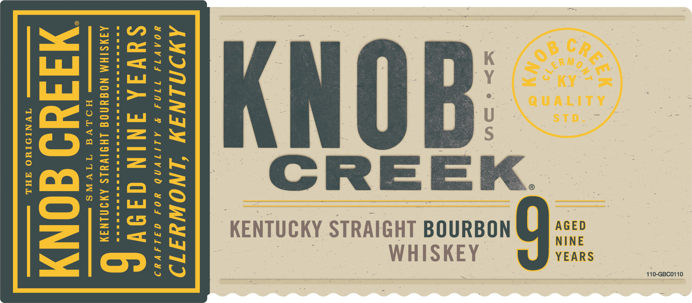
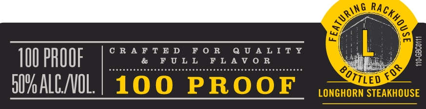
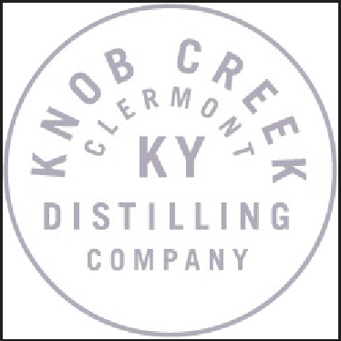
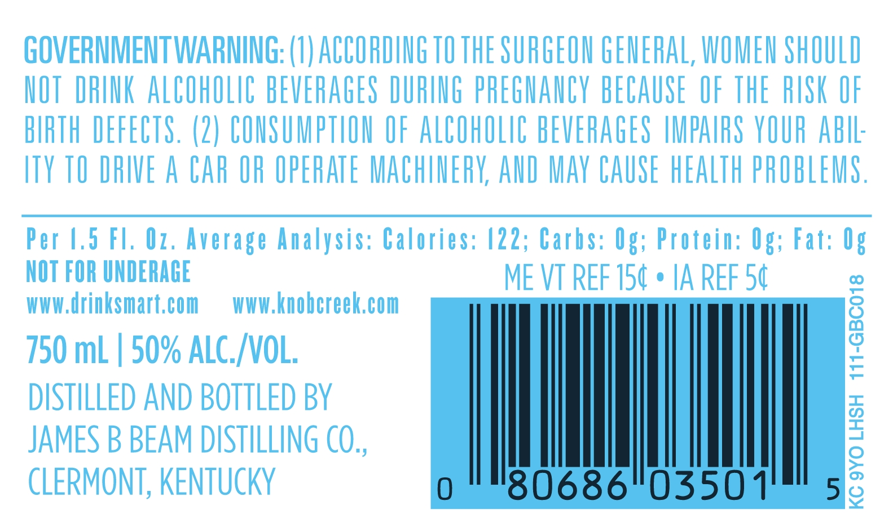

# TTB COLA Label Images - TTBID 22322001000099

**Brand Name:** KNOB CREEK

**Issue Date:** 11/21/2022

**Origin Code:** 22

**Product Class/Type:** 101

**Source:** [TTB Public COLA Registry](https://ttbonline.gov/colasonline/viewColaDetails.do?action=publicFormDisplay&ttbid=22322001000099)

## Label Images

### Label 1

### Label 2

### Label 3

### Label 4

## Extracted Label Text

*Text extracted via OCR - may contain errors*

*2 image(s) excluded: text did not meet readability threshold*

### Label 1

110-GBC0110

WHISKEY

KENTUCKY STRAIGHT BOURBON

AWMINLININ ‘INOWYITI

YOAVTA T71NA BP ALITVNO HOS AILAVAD

SUVA ININ GA9V

AAMSTHM NOGUNOG LHIIVYLS AMININAY
HOLVA VSS —_—_—_—_—

Midd aONy

os «TY NID O BA ee

### Label 2

> ~

Ginikiyir x D FOR

UALITY

100 PROOF

FULL FLAV OR

"ae

D7 ALCVOL.
