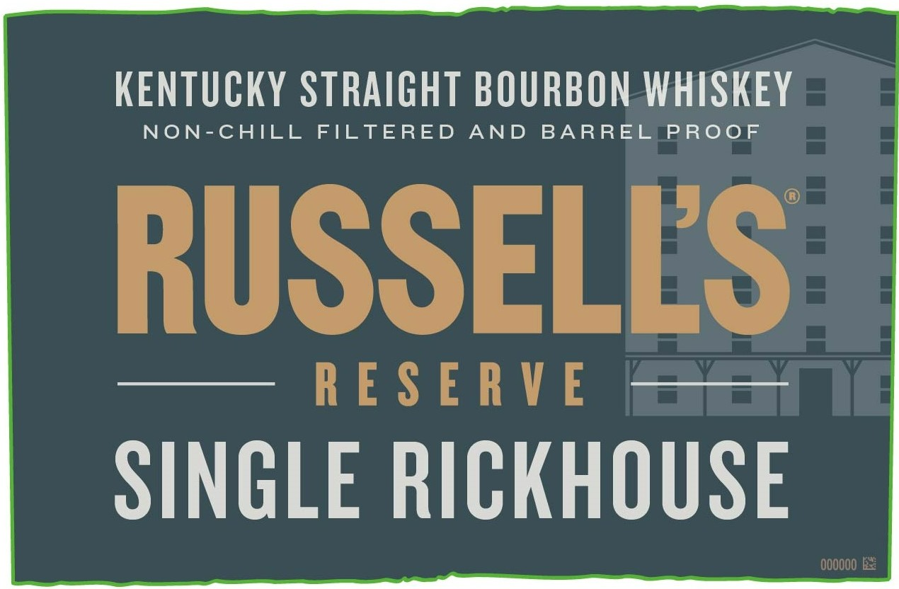
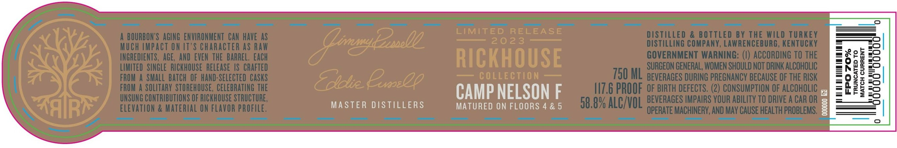
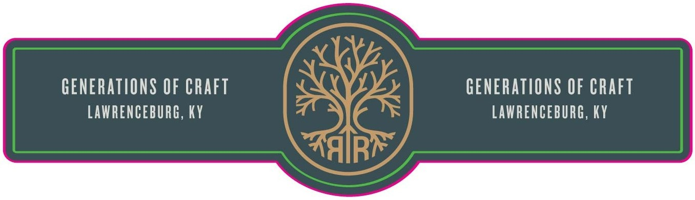

# TTB COLA Label Images - TTBID 22326001000282

**Brand Name:** RUSSELL'S RESERVE

**Fanciful Name:** SINGLE RICKHOUSE

**Issue Date:** 11/23/2022

**Origin Code:** 22

**Product Class/Type:** 101

**Source:** [TTB Public COLA Registry](https://ttbonline.gov/colasonline/viewColaDetails.do?action=publicFormDisplay&ttbid=22326001000282)

## Label Images

### Label 1

### Label 2

### Label 3

## Extracted Label Text

*Text extracted via OCR - may contain errors*

*1 image(s) excluded: text did not meet readability threshold*

### Label 1

KENTUCKY STRAIGHT BOURBON WHISKEY

NON-CHILL FILTERED AND BARREL PROOF

RUSSELES

—— RESERVE Se =

SINGLE RICKHOUSE

### Label 2

INCATED TO
‘CH CURRENT
eT aT |

dda"do0do

CAMP NELSON F

MASTER DISTILLERS MATURED ON FLOORS 4&5
